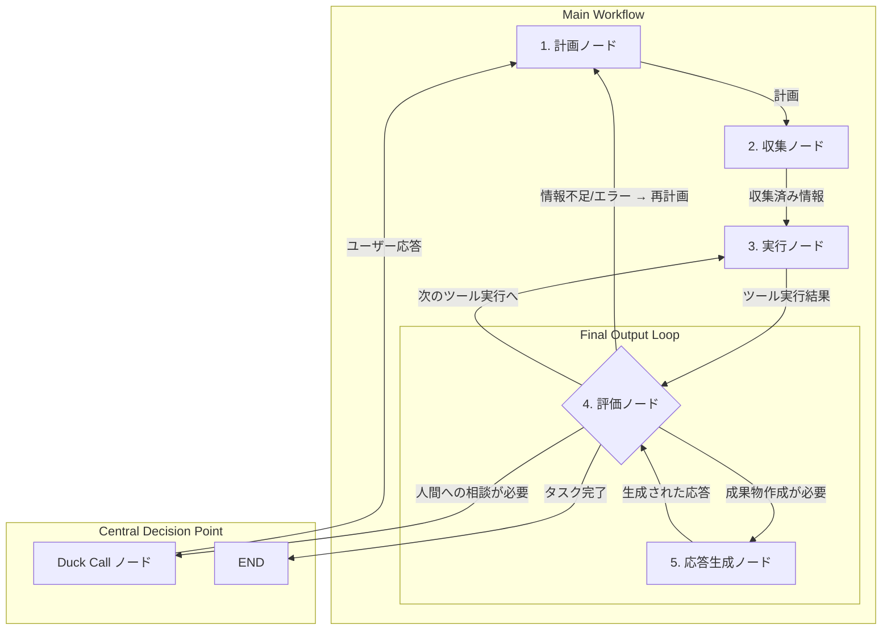

### **設計ドキュメント：`Duckflow` 5ノード・オーケストレーション・アーキテクチャ**

**バージョン:** 3.0
**目的:** 思考、情報収集、実行、評価、そして応答生成という、エージェントの行動サイクルを5つの専門家ノードに分離する。特に`評価ノード`を、全ての状態変化が集約され、次の行動が決定される「品質ゲート」兼「司令塔」として機能させることで、エージェントの自律性、品質、そして信頼性を最大化する。

#### **1. アーキテクチャ概要：評価ノード中心の品質保証ループ**

`Duckflow`のメインループは、以下の5つの専門家ノードで構成される。全ての「アクション」（ツール実行や応答生成）の結果は、必ず`4️⃣評価・継続ノード`に集約され、そこで次の行き先が決定される。

---

### **2. 各ノードの詳細設計**

#### **`1️⃣理解・計画ノード` (The Architect)**
*   **責務:** ユーザーの要求と現在の`AgentState`を基に、**「何を（What）」**と**「なぜ（Why）」**を定義し、階層的な実行計画（`The Pecking Order`）を立てる。
*   **入力:** `AgentState`（ユーザー入力、対話履歴、`Duck Call`からの応答、再計画の指示など）
*   **処理:**
    1.  `LLMService`の`Classification`ロールを呼び出し、ユーザー要求から`TaskProfile`（タスクのDNA）を生成する。
    2.  `LLMService`の`Planning`ロールを呼び出し、`TaskProfile`と長期記憶（`The Castle`）を参考に、`The Pecking Order`（`Task`の木構造）を生成または更新する。
    3.  `Quack Overflow Alarm`のチェックを行う。
*   **出力:** 更新された`AgentState`（`task_tree`が構築/更新され、`current_task_id`が設定される）。
*   **次のノ-ド:** 常に`2️⃣情報収集ノード`へ。

#### **`2️⃣情報収集ノード` (The Librarian)**
*   **責務:** `The Pecking Order`で指示された、現在のサブタスクを実行するために必要な情報を、**「どのように（How）」**効率的に収集するかを実行する。
*   **入力:** `AgentState`（`current_task_id`, `task_tree`）
*   **処理:**
    *   現在のタスクの`TaskProfile`に基づき、`Duck Scan`ツールや`Duck FS`の読み取り系ツール（`read`, `get_summary`など）を**機械的に**呼び出す。
    *   このノードは原則として**LLMを呼ばない。**
*   **出力:** 更新された`AgentState`（収集した情報が`gathered_info`に格納される）。
*   **次のノード:** 常に`3️⃣安全実行ノード`へ。

#### **`3️⃣安全実行ノード` (The Operator)**
*   **責務:** 計画された「世界に影響を与える」アクション（ファイル書き込み、コマンド実行など）を、**安全**かつ**忠実**に実行する。
*   **入力:** `AgentState`（`current_task_id`, `task_tree`, `gathered_info`）
*   **処理:**
    *   現在のタスクの`TaskProfile`に基づき、リスクを評価する。
    *   もし`intent`が`WRITE`や`EXECUTE`の場合、`Duck Call`を要求し、ユーザーに**実行承認**を求めることがある。
    *   承認が得られたら、`Duck FS`の書き込み系ツールや`execute_shell`ツールを**機械的に**実行する。
    *   このノードは原則として**LLMを呼ばない。**
*   **出力:** 更新された`AgentState`（ツールの実行結果が`execution_result`に格納される）。
*   **次のノード:** 常に`4️⃣評価・継続ノード`へ。

#### **`4️⃣評価・継続ノード` (The Quality Gate & Controller)**
*   **責務:** 全てのアクションの結果を集約・評価し、**「次にどこへ行くべきか」**を決定する、ループ全体の**司令塔**。
*   **入力:** `AgentState`（`execution_result` or `response_generation_result`, `task_tree`, `vitals`など）
*   **処理:**
    1.  **`D.U.C.K. Vitals System`の更新:** まず、今回のループの結果を基に、`Mood`, `Focus`, `Stamina`の各バイタル値を更新する。
    2.  `LLMService`の`Judgement`ロールを呼び出す。`PromptCompiler`は、`TaskProfile`に基づいた適切な「評価基準」をプロンプトに注入する。
    3.  評価AIは、タスクの進捗、品質、そして自身の`Confidence Score`を評価し、次の行動（`next_action`）を提案する。
    4.  **`The Pacer`の介入:** AIの提案と、現在のバイタル値を総合的に見て、最終的な行き先を決定する。例えば、AIが`CONTINUE`を提案しても、`Stamina`が尽きていれば、強制的に`HALT_AND_CONSULT`（`Duck Call`を起動）に上書きする。
*   **出力:** 更新された`AgentState`と、**次のノード名**（`planning`, `execution`, `response_generation`, `duck_call`, `END`のいずれか）。
*   **次のノード:** 状況に応じて、全てのノードに遷移する可能性がある。

#### **`5️⃣応答生成ノード` (The Scribe)**
*   **責務:** 収集・実行された情報を基に、ユーザーに提示するための**最終的な成果物（レポート、説明文など）**を作成する。
*   **入力:** `AgentState`（`gathered_info`, `execution_result`, `understanding`の結果など）
*   **処理:**
    *   現在のタスクの`TaskType`に対応する、事前定義された**「成果物テンプレート（`template_structure`）」**を取得する。
    *   収集済みの情報を、テンプレートに**機械的に**流し込み、整形されたMarkdown文字列などを生成する。
    *   **このノードは原則としてLLMを呼ばない。**
*   **出力:** 更新された`AgentState`（生成された成果物が`final_response`に格納される）。
*   **次のノード:** 常に`4️⃣評価・継続ノード`へ戻り、生成された成果物の**品質レビュー**を受ける。

---
この5ノード設計により、`Duckflow`は、**思考と実行の明確な分離**、**品質保証のループ**、そして**状況に応じた柔軟なフロー制御**という、高度な自律エージェントに求められる全ての要件を満たす、堅牢なアーキテクチャを手に入れます。