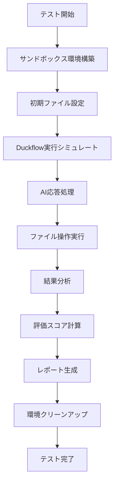

# Duckflow サンドボックス評価システム実装計画書

**バージョン:** 1.0  
**作成日:** 2025-08-08  
**ステータス:** 計画フェーズ

## 1. プロジェクト概要

### 1.1 目的
Duckflowの機能を安全にテストするためのサンドボックス環境と評価システムを構築し、実環境への影響なしに以下を実現する：

- **機能正確性の評価**: ファイル操作、プロジェクト分析の精度測定
- **セキュリティ機能の検証**: 危険操作の検出・ブロック機能の確認
- **ユーザビリティの向上**: よくある開発シナリオでの動作確認
- **継続的品質保証**: 開発プロセスに組み込める自動評価

### 1.2 スコープ
- ✅ **対象**: ファイル操作、プロジェクト分析、コード生成機能
- ✅ **環境**: 分離されたファイルシステムサンドボックス
- ❌ **対象外**: ネットワーク機能、実際のLLM API呼び出し、システム管理機能

## 2. テストシナリオ設計

### 2.1 シナリオ一覧

#### シナリオ1: 基本ファイル作成
```yaml
名前: basic_file_creation
説明: 単一Pythonファイルの作成と基本機能確認
難易度: ⭐ (初級)
実行時間目安: 30秒
```

**詳細仕様:**
- **入力**: "Hello Worldを出力するPythonファイル test.py を作成してください"
- **期待動作**:
  1. test.py ファイルが作成される
  2. print("Hello World") を含むコードが生成される
  3. Python構文として正しい
  4. 実行可能なコード
- **評価ポイント**:
  - ファイル作成成功率 (30%)
  - 内容の正確性 (40%)
  - 構文の正しさ (30%)

#### シナリオ2: プロジェクト構造作成
```yaml
名前: project_structure_creation
説明: Pythonパッケージの基本構造作成
難易度: ⭐⭐ (中級)
実行時間目安: 60秒
```

**詳細仕様:**
- **入力**: "Pythonパッケージの基本構造を作成してください。パッケージ名はmyappです"
- **期待動作**:
  1. 適切なディレクトリ構造の作成 (`myapp/`, `tests/`)
  2. 必要ファイルの生成 (`setup.py`, `__init__.py`, `requirements.txt`)
  3. 各ファイルに適切な内容が含まれる
- **評価ポイント**:
  - ディレクトリ構造の正確性 (25%)
  - 必要ファイルの存在 (25%)
  - ファイル内容の妥当性 (25%)
  - Python パッケージとしての完成度 (25%)

#### シナリオ3: 設定ファイル編集
```yaml
名前: config_file_modification
説明: 既存ファイルの内容変更・追記
難易度: ⭐ (初級)
実行時間目安: 30秒
```

**詳細仕様:**
- **前提条件**: requirements.txt に "flask==2.0.1" が既に存在
- **入力**: "requirements.txtにrequests==2.28.1を追加してください"
- **期待動作**:
  1. 既存内容を保持
  2. 新しい依存関係を適切な形式で追加
  3. ファイル形式を維持
- **評価ポイント**:
  - 既存内容の保持 (40%)
  - 新規内容の追加 (40%)
  - フォーマットの維持 (20%)

#### シナリオ4: 既存プロジェクト分析
```yaml
名前: project_analysis
説明: 既存プロジェクトの構成理解と分析
難易度: ⭐⭐⭐ (上級)
実行時間目安: 90秒
```

**詳細仕様:**
- **前提条件**: Flask アプリケーションファイル一式
  - main.py (Flask アプリ)
  - requirements.txt (依存関係)
  - config.py (設定)
  - README.md (文書)
- **入力**: "このプロジェクトの構成を分析して、どんなアプリケーションか教えてください"
- **期待動作**:
  1. ファイル構造の認識
  2. フレームワーク (Flask) の検出
  3. 依存関係の把握
  4. プロジェクトタイプの分類
  5. 分析結果の文章化
- **評価ポイント**:
  - フレームワーク検出精度 (25%)
  - 依存関係識別精度 (25%)
  - プロジェクトタイプ分類 (25%)
  - 分析報告の質 (25%)

#### シナリオ5: Webアプリ開発
```yaml
名前: web_app_development
説明: 実用的なFlask Todoアプリケーション作成
難易度: ⭐⭐⭐ (上級)
実行時間目安: 120秒
```

**詳細仕様:**
- **入力**: "Flaskで簡単なTodoアプリを作成してください。app.py、templates/index.html、static/style.cssが必要です"
- **期待動作**:
  1. 適切な Flask アプリケーション構造
  2. 動作するPythonコード (app.py)
  3. 有効な HTML テンプレート
  4. CSS スタイリング
  5. MVC パターンの実装
- **評価ポイント**:
  - アプリケーション構造 (30%)
  - Python コードの質 (30%)
  - HTML/CSS の妥当性 (25%)
  - 機能の完成度 (15%)

### 2.2 シナリオ実行フロー



## 3. サンドボックス環境設計

### 3.1 アーキテクチャ概要

```
┌─────────────────────────────────────────────────────────┐
│                   テストランナー                        │
├─────────────────────────────────────────────────────────┤
│  ┌─────────────────┐  ┌─────────────────┐              │
│  │ シナリオ管理    │  │ 評価エンジン    │              │
│  └─────────────────┘  └─────────────────┘              │
├─────────────────────────────────────────────────────────┤
│                サンドボックス環境                       │
│  ┌─────────────────┐  ┌─────────────────┐              │
│  │ FS分離          │  │ モックLLM       │              │
│  └─────────────────┘  └─────────────────┘              │
├─────────────────────────────────────────────────────────┤
│              一時ファイルシステム                       │
│  /tmp/duckflow_test_scenario_XXXXX/                     │
│    ├── test_files/                                     │
│    ├── generated_files/                                │
│    └── analysis_results/                               │
└─────────────────────────────────────────────────────────┘
```

### 3.2 FileSystemSandbox 設計

#### クラス構造
```python
class FileSystemSandbox:
    """ファイルシステム分離サンドボックス"""
    
    # 初期化・環境構築
    def __init__(scenario_name: str)
    def setup_scenario_files(setup_files: List[Dict])
    def setup_fake_system_structure()  # 将来のセキュリティテスト用
    
    # コンテキスト管理
    def __enter__()
    def __exit__()
    
    # シナリオ実行
    def execute_duckflow_scenario(user_input: str) -> Dict
    def get_mock_ai_responses(user_input: str) -> List[str]
    def _process_ai_response(ai_response: str)
    def _execute_file_operation(operation, filename, content)
    
    # 結果分析
    def analyze_execution_results() -> Dict
    def _analyze_project_content(file_path, content, analysis)
    def _analyze_project_structure(analysis) -> Dict
```

#### 主要機能

1. **環境分離**
   - 一時ディレクトリでの完全分離
   - 作業ディレクトリの自動切り替え
   - 自動クリーンアップ

2. **ファイル操作処理**
   - `FILE_OPERATION:CREATE` パターン解析
   - `FILE_OPERATION:EDIT` パターン解析
   - コードブロック (```) 内容の抽出と処理

3. **プロジェクト分析**
   - フレームワーク検出 (Flask, Django, FastAPI)
   - 依存関係抽出 (requirements.txt, import文)
   - プロジェクトタイプ分類
   - 構造妥当性チェック

### 3.3 モックLLM応答システム

#### 応答生成戦略
```python
def get_mock_ai_responses(user_input: str) -> List[str]:
    """入力パターンに応じた適切なモック応答を生成"""
    
    patterns = {
        "hello_world_creation": {
            "triggers": ["Hello World", "test.py", "作成"],
            "response": "FILE_OPERATION:CREATE test.py\n```python\n..."
        },
        "project_analysis": {
            "triggers": ["プロジェクト", "分析", "構成"],
            "response": "プロジェクト分析結果:\n## 概要\n..."
        },
        # ... 他のパターン
    }
```

#### 応答品質保証
- 各シナリオに特化した高品質な応答
- 実際のDuckflow出力形式に準拠
- エラーケース・エッジケースもカバー

## 4. 評価システム設計

### 4.1 評価メトリクス

#### 4.1.1 基本メトリクス
```python
evaluation_metrics = {
    "file_creation_score": float,      # ファイル作成成功率 (0.0-1.0)
    "content_score": float,            # 内容の正確性 (0.0-1.0)  
    "syntax_score": float,             # 構文の正しさ (0.0-1.0)
    "project_analysis_score": float,   # プロジェクト分析精度 (0.0-1.0)
    "structure_score": float,          # 構造の妥当性 (0.0-1.0)
    "overall_score": float             # 総合スコア (0.0-1.0)
}
```

#### 4.1.2 詳細評価項目

| 評価項目 | 重み | 計算方法 | 合格基準 |
|----------|------|----------|----------|
| ファイル作成 | 20% | 期待ファイル数 / 実際作成数 | ≥0.8 |
| 内容正確性 | 25% | キーワード一致率の平均 | ≥0.7 |
| 構文妥当性 | 20% | 構文エラー無しファイル率 | ≥0.9 |
| プロジェクト分析 | 20% | 検出項目の正答率 | ≥0.7 |
| 構造妥当性 | 15% | 構造チェック項目通過率 | ≥0.8 |

### 4.2 SandboxTestRunner 設計

#### クラス構造
```python
class SandboxTestRunner:
    """サンドボックステスト実行・評価管理"""
    
    def load_test_scenarios() -> List[Dict]
    def run_scenario(scenario: Dict) -> Dict
    def run_all_scenarios() -> Dict  
    def evaluate_results(actual: Dict, expected: Dict) -> Dict
    def generate_report(results: Dict) -> str
```

#### 実行フロー
1. **シナリオ読み込み**: YAML/JSON形式の設定読み込み
2. **並行実行**: 複数シナリオの並行処理 (オプション)
3. **結果集約**: 全シナリオ結果の統合
4. **レポート生成**: HTML/JSON形式での結果出力

## 5. 実装計画

### 5.1 開発フェーズ

#### フェーズ1: 基盤実装 (Week 1)
**目標**: サンドボックス環境とテストフレームワークの基本機能

- [ ] **FileSystemSandbox** 基本実装
  - 一時ディレクトリ管理
  - ファイル操作処理
  - コンテキスト管理
- [ ] **SandboxTestRunner** 基本実装
  - シナリオ管理
  - 単体シナリオ実行
- [ ] **シナリオ1-2** 実装・テスト
  - 基本ファイル作成
  - プロジェクト構造作成

**成果物**:
- `sandbox_framework.py` - 基盤フレームワーク
- `test_scenarios.py` - シナリオ定義
- 実行可能なデモ

#### フェーズ2: 分析機能実装 (Week 2)
**目標**: プロジェクト分析とコード解析機能

- [ ] **プロジェクト分析エンジン** 実装
  - フレームワーク検出
  - 依存関係抽出  
  - 構造妥当性チェック
- [ ] **シナリオ3-4** 実装・テスト
  - 設定ファイル編集
  - 既存プロジェクト分析
- [ ] **評価システム** 詳細実装
  - メトリクス計算
  - スコアリングアルゴリズム

**成果物**:
- `project_analyzer.py` - プロジェクト分析エンジン
- `evaluation_engine.py` - 評価システム
- 分析レポート機能

#### フェーズ3: 高度機能・統合 (Week 3)
**目標**: 完全機能統合とレポーティング

- [ ] **シナリオ5** 実装・テスト
  - Webアプリ開発シナリオ
- [ ] **レポートシステム** 実装
  - HTML レポート生成
  - 詳細分析データの可視化
- [ ] **CI/CD統合** 準備
  - pytest プラグイン化
  - 自動実行スクリプト

**成果物**:
- 完全版 `sandbox_evaluation.py`
- HTML レポートテンプレート
- CI/CD 統合スクリプト

### 5.2 ファイル構成

```
duckflow/
├── tests/
│   ├── sandbox/
│   │   ├── __init__.py
│   │   ├── sandbox_framework.py      # メインフレームワーク
│   │   ├── test_scenarios.py         # シナリオ定義
│   │   ├── evaluation_engine.py      # 評価システム
│   │   ├── project_analyzer.py       # プロジェクト分析
│   │   └── report_generator.py       # レポート生成
│   ├── sandbox_tests/
│   │   ├── test_basic_scenarios.py   # 基本シナリオテスト
│   │   ├── test_project_analysis.py  # 分析機能テスト
│   │   └── test_evaluation.py        # 評価システムテスト
│   └── conftest.py                   # pytest 設定
├── docs/
│   ├── SANDBOX_EVALUATION_PLAN.md    # この計画書
│   └── sandbox_reports/              # 生成レポート
└── scripts/
    ├── run_sandbox_tests.py          # 実行スクリプト
    └── generate_scenario_report.py   # レポート生成スクリプト
```

### 5.3 技術スタック

#### 核心技術
- **Python 3.10+**: メイン開発言語
- **pathlib**: ファイルシステム操作
- **tempfile**: 一時環境管理
- **ast**: Python構文解析
- **re**: パターンマッチング

#### テスト・評価
- **pytest**: テストフレームワーク
- **unittest.mock**: LLM応答モック
- **yaml**: 設定ファイル管理
- **json**: データ交換・保存

#### レポート・可視化
- **jinja2**: HTMLテンプレート生成
- **matplotlib**: グラフ生成 (オプション)
- **pandas**: データ分析 (オプション)

## 6. 品質保証

### 6.1 テスト戦略

#### 6.1.1 ユニットテスト
- `FileSystemSandbox` 各メソッドの単体テスト
- `SandboxTestRunner` 評価ロジックのテスト
- プロジェクト分析機能の単体テスト

#### 6.1.2 統合テスト  
- エンドツーエンドシナリオ実行テスト
- 複数シナリオ並行実行テスト
- エラーハンドリング統合テスト

#### 6.1.3 回帰テスト
- 既存シナリオの継続的実行
- パフォーマンス回帰チェック
- 評価精度の維持確認

### 6.2 パフォーマンス要件

| 項目 | 目標値 | 計測方法 |
|------|--------|----------|
| 単一シナリオ実行時間 | < 60秒 | 実行時間計測 |
| 全シナリオ実行時間 | < 5分 | バッチ実行計測 |
| メモリ使用量 | < 100MB | psutil監視 |
| 一時ファイル容量 | < 50MB | ディスク使用量チェック |

### 6.3 セキュリティ考慮事項

#### 分離保証
- 一時ディレクトリによる完全分離
- プロセス権限制限
- ネットワークアクセス無効化

#### 危険操作防止
- システムファイルへのアクセス禁止
- 実行権限制限
- リソース使用量制限

## 7. 運用・保守

### 7.1 継続的改善

#### 7.1.1 シナリオ拡張
- 新機能リリース時のシナリオ追加
- ユーザーフィードバックに基づく改善
- エラーケース・エッジケースの補完

#### 7.1.2 評価精度向上
- 実際の使用パターンとの比較分析
- 評価メトリクスの調整・最適化
- 新しい評価観点の追加

### 7.2 監視・アラート

#### 7.2.1 品質監視
- 成功率の継続的監視
- 評価スコアの傾向分析
- 異常パターンの早期検出

#### 7.2.2 運用監視
- 実行時間の監視
- リソース使用量の追跡
- エラー発生率の監視

## 8. リスク管理

### 8.1 技術的リスク

| リスク | 影響度 | 対策 |
|--------|--------|------|
| ファイルシステム分離不完全 | 高 | 厳格なパス検証・テスト |
| モックLLM応答の品質低下 | 中 | 実LLM応答との継続比較 |
| 評価メトリクスの不正確さ | 中 | 人間による評価との照合 |
| パフォーマンス劣化 | 低 | 継続的なベンチマーク |

### 8.2 運用リスク

| リスク | 影響度 | 対策 |
|--------|--------|------|
| シナリオの陳腐化 | 中 | 定期的な見直し・更新 |
| 開発チームへの負荷 | 低 | 自動化による負荷軽減 |
| 環境依存の問題 | 低 | クロスプラットフォーム対応 |

## 9. 成功指標

### 9.1 定量的指標
- **システム安定性**: テスト実行成功率 > 95%
- **品質検出精度**: 不具合検出率 > 80%
- **実行効率**: 全シナリオ実行時間 < 5分
- **カバレッジ**: 機能カバレッジ > 70%

### 9.2 定性的指標
- **開発者体験**: チーム満足度調査 > 4.0/5.0
- **保守性**: 新シナリオ追加工数 < 2時間
- **信頼性**: 継続的な品質保証の実現
- **拡張性**: 新機能への容易な対応

## 10. 付録

### 10.1 参考資料
- [Duckflow設計ドキュメント](./CLAUDE.md)
- [Python単体テスト最適事例](https://docs.python.org/ja/3/library/unittest.html)
- [サンドボックス技術概要](https://en.wikipedia.org/wiki/Sandbox_(software_development))

### 10.2 用語定義
- **サンドボックス**: 分離された安全なテスト実行環境
- **シナリオ**: 具体的な使用例を模擬したテストケース
- **モックLLM**: 実際のLLM APIを模擬した応答システム
- **評価メトリクス**: 機能品質を定量化する指標

---

**文書管理**
- 作成者: Claude Code Assistant
- レビュアー: 開発チーム
- 承認者: プロジェクトマネージャー
- 次回更新予定: フェーズ1完了時