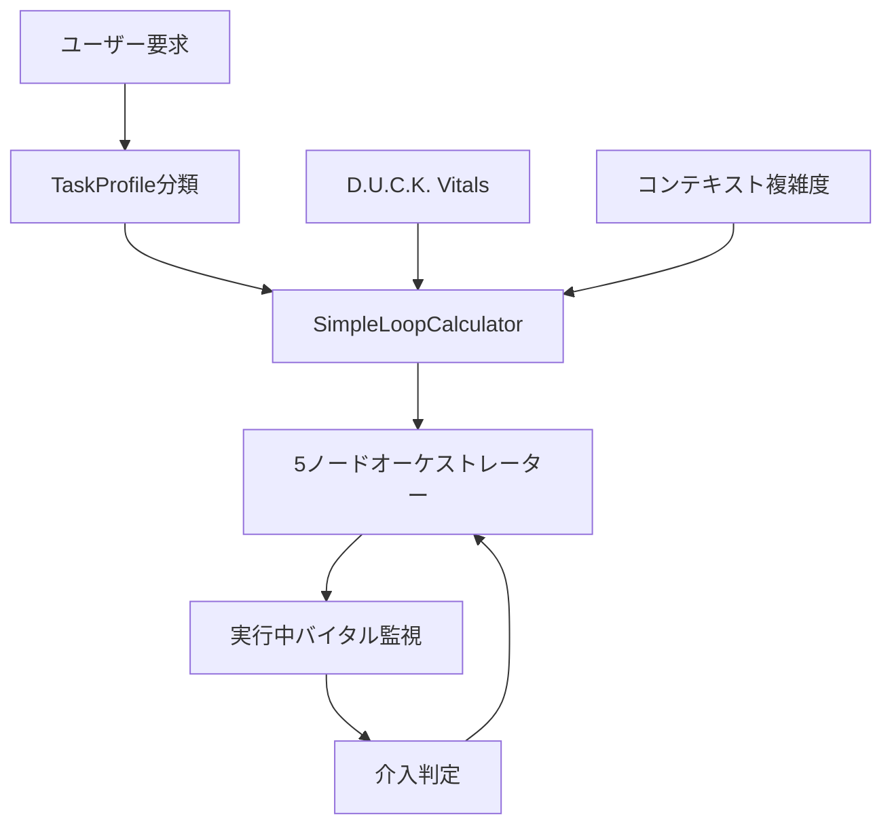

# Duck Pacemaker 動的ループ制限設計プラン (シンプル版)

## 概要

現在の固定ループ制限（3 回/10 回）を、D.U.C.K. Vitals System とタスク複雑度に基づくシンプルな動的制御システムに変更する設計プラン。

## 設計哲学

### 🦆 「確実に動く」シンプルな Duck Pacemaker

**基本原則:**

1. **シンプル第一**: 複雑な機能より確実な動作を優先
2. **設定値の分散改善**: 固定値による画一的制限から、タスク特性に応じた適切な制限へ
3. **透明性**: 制限決定の理由を明確に説明
4. **段階的拡張**: v1 では基本機能のみ、将来的に学習機能等を追加

## 現状の課題

1. **固定制限による設定値の分散不足**

   - 簡単なタスク: 5 回で十分なのに 10 回まで実行される無駄
   - 複雑なタスク: 10 回では不足する場合がある
   - タスクの性質を考慮しない画一的制限

2. **D.U.C.K. Vitals System の活用不足**
   - バイタル監視（AI の自信・思考一貫性・試行回数）は優秀だが、制限値は固定
   - タスク複雑度を考慮しない一律制限

## シンプル動的制御システム設計

### アーキテクチャ全体像



### 1. シンプル制限計算器 (Simple Loop Calculator)

#### 1.1 シンプル計算式

動的制限は以下のシンプルな計算式で決定されます：

```
最終制限 = min(
    max(
        タスクベース値 × バイタル係数 × 複雑度係数,
        最小制限値(3)
    ),
    最大制限値(20)
)
```

#### 1.2 各係数の計算（シンプル版）

**バイタル係数 (Vitals Factor)**

```python
def _calculate_vitals_factor(self, vitals: Vitals) -> float:
    # D.U.C.K. Vitalsの正しい解釈：
    # mood = AIのプランに関する自信
    # focus = AIの思考の一貫性
    # stamina = 1タスクの試行回数（消耗度）

    # シンプルな重み付け平均
    vitals_score = (
        vitals.mood * 0.4 +      # プラン自信度：重要（40%）
        vitals.focus * 0.4 +     # 思考一貫性：重要（40%）
        vitals.stamina * 0.2     # 試行回数消耗：補助（20%）
    )

    # シンプルな3段階調整
    if vitals_score < 0.4:
        return 0.7  # 低調：制限
    elif vitals_score > 0.8:
        return 1.2  # 好調：増加
    else:
        return 1.0  # 普通：そのまま
```

**複雑度係数 (Complexity Factor)**

```python
def _calculate_complexity_factor(self, context_complexity: float) -> float:
    # タスク複雑度に応じたシンプルな調整
    # 1.0 - 1.4 の範囲で調整（控えめ）
    return 1.0 + context_complexity * 0.4
```

#### 1.3 タスクプロファイル別ベース値（改善版）

設定値の分散改善のため、各タスクタイプに適切なベース値を設定：

| タスクタイプ          | ベース値 | 設計根拠                                                   |
| --------------------- | -------- | ---------------------------------------------------------- |
| **SIMPLE_QUESTION**   | 5 回     | 単純な質問でも確実な回答のため余裕を持たせる               |
| **CODE_ANALYSIS**     | 12 回    | コード読取 → 構造理解 → 問題特定 → 分析 → 報告の多段階処理 |
| **FILE_OPERATION**    | 8 回     | ファイル探索 → 読取 → 処理 → 書込 → 確認 → 検証の流れ      |
| **COMPLEX_REASONING** | 18 回    | 複雑な論理的思考が必要。多角的検討と段階的推論             |
| **MULTI_STEP_TASK**   | 15 回    | 計画立案 → 実行 → 中間確認 → 調整 → 完了の管理型タスク     |
| **GENERAL_CHAT**      | 6 回     | 自然な対話でも文脈理解に時間をかける                       |
| **CREATIVE_WRITING**  | 10 回    | アイデア発想 → 構成 → 執筆 → 推敲 → 完成の創作プロセス     |
| **DEBUGGING**         | 14 回    | 問題再現 → 原因特定 → 分析 → 解決策 → テスト → 確認        |
| **RESEARCH**          | 16 回    | 情報探索 → 収集 → 分析 → 統合 → 検証 → 報告の調査プロセス  |

### 2. コンテキスト複雑度分析（シンプル版）

```python
class SimpleContextAnalyzer:
    @staticmethod
    def analyze_complexity(state) -> float:
        """コンテキスト複雑度を分析 (0.0-1.0)"""
        factors = []

        # ファイル数による複雑度（シンプル）
        file_count = len(state.collected_context.get("gathered_info", {}).get("collected_files", {}))
        factors.append(min(file_count / 8.0, 1.0))  # 8ファイルで最大

        # 対話履歴の長さ（シンプル）
        history_length = len(state.conversation_history)
        factors.append(min(history_length / 15.0, 1.0))  # 15ターンで最大

        # エラー発生率（シンプル）
        if len(state.tool_executions) > 0:
            error_rate = state.error_count / len(state.tool_executions)
            factors.append(min(error_rate * 3.0, 1.0))  # エラー率33%で最大
        else:
            factors.append(0.0)

        return sum(factors) / len(factors) if factors else 0.3
```

### 3. シンプルフォールバック

```python
class SimpleFallback:
    def calculate_with_fallback(self, task_profile: TaskProfileType, vitals: Vitals, complexity: float) -> int:
        """シンプルなフォールバック付き計算"""
        try:
            # メイン計算
            return self.calculate_dynamic_limit(task_profile, vitals, complexity)
        except Exception as e:
            # フォールバック：設定ファイルの最大値を使用
            logger.warning(f"動的計算失敗、フォールバック実行: {e}")
            return self.get_config_max_loops()  # 設定ファイルから取得

    def get_config_max_loops(self) -> int:
        """設定ファイルから最大ループ数を取得"""
        try:
            from ..base.config import config_manager
            config = config_manager.load_config()
            return config.duck_pacemaker.dynamic_limits.max_loops
        except:
            return 15  # 最終フォールバック
```

### 4. 実装クラス（シンプル版）

```python
class SimpleDynamicPacemaker:
    """シンプルな動的Duck Pacemaker"""

    def __init__(self):
        self.base_loops = {
            TaskProfileType.SIMPLE_QUESTION: 5,
            TaskProfileType.CODE_ANALYSIS: 12,
            TaskProfileType.FILE_OPERATION: 8,
            TaskProfileType.COMPLEX_REASONING: 18,
            TaskProfileType.MULTI_STEP_TASK: 15,
            TaskProfileType.GENERAL_CHAT: 6,
            TaskProfileType.CREATIVE_WRITING: 10,
            TaskProfileType.DEBUGGING: 14,
            TaskProfileType.RESEARCH: 16
        }
        self.fallback = SimpleFallback()

    def calculate_max_loops(
        self,
        task_profile: TaskProfileType,
        vitals: Vitals,
        context_complexity: float = 0.3
    ) -> Dict[str, Any]:
        """動的制限を計算"""

        # ベース値取得
        base_loops = self.base_loops.get(task_profile, 8)

        # バイタル係数計算
        vitals_score = (
            vitals.mood * 0.4 +      # プラン自信度
            vitals.focus * 0.4 +     # 思考一貫性
            vitals.stamina * 0.2     # 試行回数消耗
        )

        if vitals_score < 0.4:
            vitals_factor = 0.7
        elif vitals_score > 0.8:
            vitals_factor = 1.2
        else:
            vitals_factor = 1.0

        # 複雑度係数計算
        complexity_factor = 1.0 + context_complexity * 0.4

        # 最終計算
        calculated = int(base_loops * vitals_factor * complexity_factor)
        final_loops = max(3, min(calculated, 20))

        return {
            "max_loops": final_loops,
            "base_loops": base_loops,
            "vitals_factor": vitals_factor,
            "complexity_factor": complexity_factor,
            "reasoning": self._generate_detailed_reasoning(
                task_profile, base_loops, vitals, vitals_factor,
                context_complexity, complexity_factor, final_loops
            )
        }

    def _generate_detailed_reasoning(
        self,
        task_profile: TaskProfileType,
        base_loops: int,
        vitals: Vitals,
        vitals_factor: float,
        context_complexity: float,
        complexity_factor: float,
        final_loops: int
    ) -> str:
        """制限決定の詳細な理由を生成"""

        # バイタル状態の説明
        vitals_status = []
        if vitals.mood < 0.5:
            vitals_status.append("プラン自信度が低下")
        elif vitals.mood > 0.8:
            vitals_status.append("プラン自信度が高い")

        if vitals.focus < 0.5:
            vitals_status.append("思考一貫性が低下")
        elif vitals.focus > 0.8:
            vitals_status.append("思考一貫性が良好")

        if vitals.stamina < 0.5:
            vitals_status.append("試行回数による消耗あり")
        elif vitals.stamina > 0.8:
            vitals_status.append("試行回数による消耗少ない")

        vitals_description = "、".join(vitals_status) if vitals_status else "標準的な状態"

        # 複雑度の説明
        if context_complexity < 0.3:
            complexity_description = "低複雑度（シンプルなタスク）"
        elif context_complexity > 0.7:
            complexity_description = "高複雑度（多ファイル・長履歴・エラー多発）"
        else:
            complexity_description = "中程度の複雑度"

        # 調整の説明
        adjustment_explanation = []
        if vitals_factor < 1.0:
            adjustment_explanation.append(f"バイタル状態により{int((1-vitals_factor)*100)}%制限")
        elif vitals_factor > 1.0:
            adjustment_explanation.append(f"バイタル状態により{int((vitals_factor-1)*100)}%増加")

        if complexity_factor > 1.0:
            adjustment_explanation.append(f"複雑度により{int((complexity_factor-1)*100)}%増加")

        adjustment_text = "、".join(adjustment_explanation) if adjustment_explanation else "調整なし"

        return f"""
🦆 Duck Pacemaker 制限決定理由:

📋 タスク分析:
  種別: {task_profile.value}
  ベース制限: {base_loops}回

🩺 バイタル診断:
  プラン自信度: {vitals.mood:.2f}
  思考一貫性: {vitals.focus:.2f}
  試行消耗度: {vitals.stamina:.2f}
  状態: {vitals_description}

🔍 コンテキスト分析:
  複雑度: {context_complexity:.2f} ({complexity_description})

⚙️ 制限計算:
  {base_loops}回 × {vitals_factor:.1f} × {complexity_factor:.1f} = {final_loops}回
  調整内容: {adjustment_text}

🎯 最終制限: {final_loops}回 (範囲: 3-20回)
        """.strip()

    def start_session(self, state: AgentState, task_profile: TaskProfileType) -> Dict[str, Any]:
        """セッション開始"""
        # コンテキスト複雑度分析
        complexity = SimpleContextAnalyzer.analyze_complexity(state)

        # 動的制限計算（フォールバック付き）
        result = self.fallback.calculate_with_fallback(task_profile, state.vitals, complexity)

        # 状態更新
        if isinstance(result, dict):
            state.graph_state.max_loops = result["max_loops"]
            return result
        else:
            # フォールバック結果の場合
            state.graph_state.max_loops = result
            return {
                "max_loops": result,
                "reasoning": f"フォールバック実行: {result}回"
            }
```

## 実装ステップ（シンプル版）

### Phase 1: 基本実装

1. `SimpleDynamicPacemaker` クラスの実装
2. タスクプロファイル別ベース値の設定
3. シンプルなバイタル係数計算

### Phase 2: 統合

1. 5 ノードオーケストレーターへの統合
2. 設定ファイルへの動的制限設定追加
3. フォールバック機能の実装

### Phase 3: テスト・調整

1. 各タスクタイプでの動作確認
2. バイタル状態による制限変化のテスト
3. 実際の使用での調整

### Phase 4: 将来拡張（v2 以降）

1. 学習機能の追加
2. より詳細な複雑度分析
3. ユーザー別カスタマイゼーション

## 期待される効果

1. **設定値の分散改善**: タスクに応じた適切な制限値
2. **効率性向上**: 簡単なタスクは早期完了、複雑なタスクは十分な時間確保
3. **安全性維持**: Duck Pacemaker による安全装置は継続
4. **透明性**: 制限決定理由の明確な説明

この設計により、複雑さを避けながら確実に動作する動的制限システムを実現できます。

## 制限決

定理由の説明システム

### ユーザー向け表示例

**通常の進捗表示:**

```
🦆 コード分析を実行中です...
```

**介入時の状況説明と選択肢提示:**

**パターン 1: 進捗停滞時**

```
🦆 Duck Pacemaker からの相談

AIがタスクの進捗がなく作業を繰り返しています（8回目）。
同じような分析や情報収集を何度も行っており、新しい発見がない状況です。

どのように進めますか？
1. 作業を中止する
2. 追加の指示や情報を提供する
3. このまま作業を継続する
4. 別のアプローチで再開する

選択してください (1-4):
```

**パターン 2: 自信不足時**

```
🦆 Duck Pacemaker からの相談

AIが現在の作業プランに自信を失っています。
複雑な問題に対して適切な解決策を見つけられずにいる状況です。

どのように進めますか？
1. より詳細な要件や制約を教える
2. 問題を分割して段階的に進める
3. 別の専門家や資料を参照する
4. 現在のアプローチを続ける

選択してください (1-4):
```

**パターン 3: 思考混乱時**

```
🦆 Duck Pacemaker からの相談

AIの思考が一貫性を失い、混乱している状況です。
複数の解決策を同時に検討して判断がつかない状態になっています。

どのように進めますか？
1. 最も重要な要件を1つ教える
2. 作業を一旦リセットして再開する
3. 現在までの成果を整理する
4. 別の角度からアプローチする

選択してください (1-4):
```

**パターン 4: 過度な試行時**

```
🦆 Duck Pacemaker からの相談

AIが同じタスクで多くの試行を重ねており、効率が低下しています。
これ以上続けても良い結果が得られない可能性があります。

どのように進めますか？
1. 現在までの結果で満足する
2. 問題の原因を一緒に分析する
3. 要求を簡素化して再挑戦する
4. 完全に別のアプローチを試す

選択してください (1-4):
```

### 開発者向けログ出力例

**開始時ログ:**

```
[DUCK_PACEMAKER] 動的制限設定: CODE_ANALYSIS, 制限14回
[DUCK_PACEMAKER] バイタル状態: mood=0.75, focus=0.80, stamina=0.65
[DUCK_PACEMAKER] 複雑度: 0.6 (中程度)
```

**実行中ログ:**

```
[DUCK_PACEMAKER] ループ8: 進捗停滞検出
[DUCK_PACEMAKER] バイタル変化: focus低下 (0.80→0.45)
[DUCK_PACEMAKER] 介入判定: 思考混乱パターン → ユーザー相談
```

**終了時ログ:**

```
[DUCK_PACEMAKER] セッション完了: 11/14回使用
[DUCK_PACEMAKER] 介入回数: 1回 (思考混乱)
[DUCK_PACEMAKER] 結果: ユーザー指示により成功
```

### ユーザー体験の改善

この状況説明型のアプローチにより：

1. **理解しやすさ**: 数値ではなく状況説明で直感的に理解
2. **選択肢の明確化**: 具体的な対処法を 4 つの選択肢で提示
3. **協調的な関係**: AI が困った時にユーザーに相談する自然な流れ
4. **学習機会**: ユーザーが AI の思考プロセスを理解する機会

ユーザーは複雑な数値を理解する必要がなく、現在の状況と取るべき行動を明確に把握できます。
