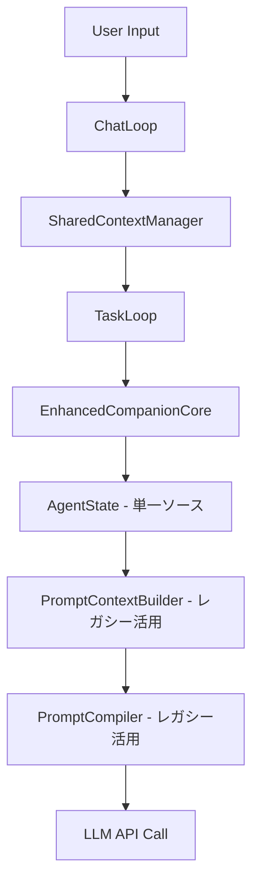

# design-doc_v3.md

## **設計ドキュメント: Duckflow v3.0**

**バージョン:** 3.1 (現実適応版)  
**作成日:** 2025 年 1 月  
**最終更新:** 2025 年 8 月 14 日  
**コンセプト:** 「相棒は演じるものではなく、なるもの」

---

## **0. プロジェクト哲学**

### **0.1. 根本思想：孤独な開発者の真のパートナー**

Duckflow は、効率や自動化を追求する従来の AI 開発ツールとは根本的に異なる価値を提供します。個人開発者が直面する最大の課題は技術的な問題ではなく、**継続する意欲の維持**です。

私たちは「速く正確に」ではなく、「一緒に続ける」を選びました。

### **0.2. 設計原則**

#### **原則 1: 透明性と誠実さ (Principle of Transparency)**

```yaml
実装指針:
  - AIの思考過程を可能な限り開示
  - 不確実性を隠さない
  - 失敗を共有する勇気
```

#### **原則 2: 不完全さの価値 (Principle of Imperfection)**

```yaml
実装指針:
  - 限界を認めることで生まれる信頼
  - 「一緒に悩む」関係性の構築
  - ユーザーの存在価値の肯定
```

#### **原則 3: 継続性重視 (Principle of Sustainability)**

```yaml
実装指針:
  - 効率より継続性を優先
  - 小さな成功の認識と祝福
  - プロジェクトの「物語」の共有
```

#### **原則 4: 非誘導的設計 (Principle of Non-Manipulation)**

```yaml
実装指針:
  - 作為的な誘導の徹底排除
  - ユーザーの主体性の尊重
  - 選択肢の公平な提示
```

---

## **1. 概要**

### **1.1. ビジョン**

個人開発者やホビープログラマーが、プロジェクトを**楽しく継続**できる環境を提供する。技術的な支援を超えて、**精神的なパートナー**として機能する AI コーディングアシスタントを実現する。

### **1.1.1. 現在の実装状況（2025 年 8 月 14 日時点）**

```yaml
✅ 実装完了:
  - Phase 1: 基本的な対話機能（main_companion.py）
  - Phase 1.5: ファイル操作機能（companion/file_ops.py）
  - 承認システム統合（companion/approval_system.py）
  - CompanionCore - 司令塔AI（companion/core.py）
  - Rich UIベース（codecrafter/ui/rich_ui.py活用）

🚧 実装中/一部完了:
  - Three-Layer Architecture（基本構造は実装済み）
  - 適応的個性システム（基本版のみ）
  - エピソード記憶システム（基本履歴管理）

📋 計画中（未実装）:
  - パターン学習システム
  - 高度なコード実行機能
  - 完全な適応的個性システム
  - 長期記憶システム
```

### **1.2. 解決する課題**

```yaml
表面的な課題:
  - コードレビューの相手がいない
  - バグ解決の相談相手がいない
  - 設計判断を一人で行う負担

本質的な課題:
  - 開発の孤独感
  - モチベーションの維持困難
  - プロジェクトの意義への疑問
  - 継続することへの心理的障壁
```

### **1.3. 成功指標**

```yaml
従来の指標（使用しない）:
  - コード生成速度
  - エラー率
  - 自動化率

真の成功指標:
  - プロジェクト継続日数
  - 開発セッションの頻度
  - プロジェクト完走率
  - ユーザーの主観的満足度
  - 「また明日も続けよう」と思える割合
```

---

## **2. アーキテクチャ**

### **2.1. Three-Layer Architecture（3 層構造）- 現在の実装状況**

```yaml
Layer 1: Companion Layer（相棒層）- ✅ 基本実装完了
実装済み:
- CompanionCore（companion/core.py）- 基本的な個性表現
- 思考過程の透明化
- ユーザーとの一対一対話
- 基本的な記憶管理（conversation_history）
未実装:
- 高度な適応的個性システム
- エピソード記憶システム

Layer 2: Intelligence Layer（知能層）- 🚧 一部実装
実装済み:
- LLM統合（codecrafter/base/llm_client.py活用）
- 基本的な意図分析（_analyze_intent）
- ファイル操作判定
未実装:
- 高度な学習・適応機能
- パターン認識システム

Layer 3: Execution Layer（実行層）- ✅ 基本機能完了
実装済み:
- SimpleFileOps（companion/file_ops.py）
- 承認システム統合（companion/approval_system.py）
- Rich UI（codecrafter/ui/rich_ui.py活用）
- 基本エラーハンドリング
未実装:
- 高度なコード実行機能
- 外部API連携（LLM以外）
```

### **2.2. データフロー**

```
User Input
    ↓
Companion Layer（個性・記憶・関係性）
    ↓
Intelligence Layer（分析・理解・学習）
    ↓
Routing Decision
    ├── Simple Response → Direct Reply
    ├── Tool Execution → Execution Layer
    └── Complex Task → Task Planning → Execution Loop

Memory System ←→ All Layers
```

### **2.3. コンポーネント間の関係**

```yaml
依存関係:
  - Companion Layer → Intelligence Layer（分析依頼）
  - Intelligence Layer → Execution Layer（実行指示）
  - 全Layer → Memory System（文脈参照）

独立性:
  - 各層は疎結合
  - インターフェースを通じた通信
  - 層の入れ替えが可能
```

---

## **3. 核心機能**

### **3.1. Priority 1: 相棒の核心機能**

#### **3.1.1. Adaptive Personality System（適応的個性システム）**

```python
class AdaptivePersonality:
    """文脈に応じて自然に変化する個性"""

    def __init__(self):
        self.base_traits = {
            "honesty": "high",      # 誠実さ
            "humility": "high",     # 謙虚さ
            "warmth": "medium"      # 温かさ
        }
        self.context_modifiers = {
            "continuous_errors": {"frustration": +1},
            "late_night": {"casualness": +1},
            "breakthrough": {"excitement": +1}
        }

    def generate_response(self, content, context):
        # 文脈に基づく自然な感情表現
        # テンプレートではなく、状況から生まれる反応
        pass
```

**実装要件:**

- 状況に応じた自然な反応
- 作為的でない感情表現
- ユーザーごとの適応

#### **3.1.2. Episodic Memory System（エピソード記憶システム）**

```python
class EpisodicMemory:
    """共有した体験の記憶"""

    def record_episode(self, event):
        episode = {
            "timestamp": now(),
            "context": event.context,
            "challenge": event.challenge,
            "approach": event.approach,
            "outcome": event.outcome,
            "emotions": event.emotional_context,
            "learnings": event.learnings
        }
        # 単なるログではなく、物語として記録

    def recall_similar(self, current_situation):
        # 「あの時も似たような...」という想起
        pass
```

**実装要件:**

- 成功と失敗の平等な記録
- 文脈の深い保存
- 物語としての構造化

#### **3.1.3. Collaborative Problem Solving（協調的問題解決）**

```python
class CollaborativeSolver:
    """一緒に考えるプロセス"""

    def explore_problem(self, issue):
        steps = [
            self.share_understanding(),    # 理解の共有
            self.brainstorm_together(),    # 一緒にアイデア出し
            self.evaluate_options(),       # 選択肢の検討
            self.decide_together(),        # 共同での決定
            self.try_and_learn()          # 試行と学習
        ]
        # 答えを出すのではなく、プロセスを共有
```

**実装要件:**

- 思考過程の可視化
- 複数選択肢の公平な提示
- ユーザーの判断を尊重

### **3.2. Priority 2: 実用性の基盤機能**

#### **3.2.1. Context-Aware File System（文脈認識ファイルシステム）**

```python
class ContextAwareFS:
    """プロジェクトの文脈を理解するファイルシステム"""

    def __init__(self):
        self.file_importance = {}      # ファイルの重要度
        self.access_patterns = {}      # アクセスパターン
        self.relationships = {}        # ファイル間の関係

    def smart_search(self, query, context):
        # 文脈を考慮した検索
        # 最近触ったファイルを優先
        # 関連ファイルの推測
        pass
```

#### **3.2.2. Pattern Learning System（パターン学習システム）**

```python
class PatternLearner:
    """ユーザーとプロジェクトのパターンを学習"""

    def learn_from_failure(self, error, context, resolution):
        # 失敗パターンの記録と学習
        pass

    def learn_user_preferences(self, choices):
        # ユーザーの好みや癖の学習
        pass
```

#### **3.2.3. Proactive Support System（能動的サポートシステム）**

```python
class ProactiveSupport:
    """適切なタイミングでのサポート"""

    def monitor_progress(self):
        # 進捗の監視（押し付けがましくない）
        pass

    def suggest_break(self, working_duration, error_rate):
        # 自然な休憩の提案
        if working_duration > 3 and error_rate > normal:
            return "ちょっと休憩しない？僕も少し処理が遅くなってきた"
```

---

## **4. 実装計画 - 現実版**

### **4.1. Phase 1: Minimum Viable Companion（✅ 完了）**

```yaml
実装内容: ✅ 完了
- 基本的なChat Loop（main_companion.py）
- 基本ツール（create/read/write/list）
- 最小限の個性（エラー時の自然な反応）
- セッション内の記憶（conversation_history）

技術スタック: ✅ 実装済み
- Python 3.10+
- OpenAI/Anthropic API（codecrafter/base/llm_client.py活用）
- Rich（ターミナルUI）- 既存実装を活用
- Pydantic（データ構造）

実際の成果物:
- main_companion.py（エントリーポイント）
- companion/core.py（CompanionCore - 774行）
- companion/file_ops.py（SimpleFileOps - 454行）
- companion/approval_system.py（承認システム統合）
```

### **4.1.5. Phase 1.5: Enhanced File Operations（✅ 完了）**

```yaml
追加実装: ✅ 完了
- 高度な承認システム統合
- ファイル操作の安全性強化
- 自然なエラー応答
- 代替案提案機能

実装成果物:
- 承認システム完全統合
- リスクレベル評価
- 操作プレビュー機能
- 優雅な劣化対応
```

### **4.2. Phase 2: Genuine Companion（🚧 次期実装目標）**

```yaml
計画実装: 📋 準備中
- 適応的個性システム（現在は基本版のみ）
- エピソード記憶（現在は基本履歴管理のみ）
- 協調的問題解決（基本フローを拡張）
- 永続的な記憶（SQLite導入予定）
- パターン学習システム（新規）

技術課題:
- 既存のcodecrafter/との統合継続
- メモリ管理の最適化
- コード実行機能の安全な実装

現実的な期間: 1-3ヶ月（既存実装活用により短縮可能）
```

### **4.3. Phase 3: Ideal Companion（📋 長期目標）**

```yaml
長期実装計画: 📋 将来実装
- 完全な適応的個性システム
- 高度なパターン学習
- コミュニティ機能
- プラグインシステム

現実的な判断:
- 基本機能の安定性を最優先
- ユーザーフィードバックに基づく優先順位調整
- 実際の使用データからの学習

期間: 6ヶ月〜1年（ユーザーフィードバック次第）
```

---

## **5. 技術仕様**

### **5.1. 開発環境**

```yaml
言語: Python 3.10+
主要ライブラリ:
  - LLM: OpenAI/Anthropic SDK
  - DB: SQLite + SQLAlchemy
  - UI: Rich/Textual
  - テスト: pytest
  - 型: Pydantic

開発環境:
  - OS: クロスプラットフォーム
  - エディタ: 任意
  - パッケージ管理: uv/pip
  - 起動オプション: 必ず-X utf8をつける
```

### **5.2. データ構造**

```python
class CompanionState:
    """相棒の状態管理"""
    conversation_history: List[Message]
    episodic_memories: List[Episode]
    working_context: WorkingContext
    user_patterns: UserPatterns
    emotional_state: EmotionalContext

class Episode:
    """エピソード記憶の単位"""
    timestamp: datetime
    challenge: str
    approach: str
    outcome: str
    emotions: Dict[str, float]
    learnings: List[str]
```

### **5.3. API 設計**

```python
class DuckflowAPI:
    async def chat(self, message: str) -> Response:
        """メインの対話インターフェース"""

    async def recall_memory(self, context: str) -> List[Episode]:
        """関連する記憶の想起"""

    async def execute_task(self, task: Task) -> TaskResult:
        """タスクの実行"""
```

---

## **6. 既存資産の活用計画 - 実際の活用状況**

### **6.1. 実際に活用済み（✅ 完了）**

```yaml
そのまま活用: ✅ 成功
- codecrafter/base/llm_client.py → LLM接続基盤
- codecrafter/ui/rich_ui.py → ターミナルUI完全活用
- codecrafter/base/config.py → 設定管理
- codecrafter/tools/file_tools.py → 参考実装として活用

改修して活用: ✅ 完了
- approval_system.py → 新実装で大幅強化
- file_ops.py → シンプル化して新実装
- core.py → CompanionCoreとして全面刷新
```

### **6.2. 段階的移行中（🚧 進行中）**

```yaml
並行稼働:
  - 既存codecrafter/パッケージ → 段階的に機能移行
  - main.py（旧版）と main_companion.py（新版）の共存
  - 既存テストスイート → 新実装対応に更新予定

技術的課題:
  - 依存関係の整理
  - 重複コードの統合
  - テストの移行
```

### **6.3. 廃棄・新規開発の実際**

```yaml
実際に廃棄: ✅ 判断済み
- 5ノードアーキテクチャ（複雑すぎ）
- LangGraph依存（シンプル化のため）
- 過度に複雑なPromptSmith機能
- RAGツール群（基本機能に集中）

新規開発完了: ✅
- companion/アーキテクチャ
- シンプルなメインループ
- 自然な個性表現システム（基本版）
- 統合承認システム（理想を超えた実装）

将来的な再統合検討:
- テスト基盤の活用
- 設定システムの拡張
- 既存ツールの selective な復活
```

---

## **7. リスクと対策**

### **7.1. 技術的リスク**

```yaml
リスク: LLMの応答一貫性
対策:
- 決定論的な記憶管理
- 文脈の明示的な保持

リスク: 「演技」の露呈
対策:
- 状況ベースの反応
- テンプレート最小化
```

### **7.2. プロダクトリスク**

```yaml
リスク: 期待値との乖離
対策:
- 早期のフィードバック収集
- 段階的な機能追加

リスク: 開発の継続性
対策:
- 最小機能から開始
- コミュニティ形成
```

---

## **8. 成功への道筋**

### **8.1. 短期目標（1 ヶ月）**

- 自分が毎日使いたくなるツール
- 基本的な「相棒感」の実現
- GitHub での公開

### **8.2. 中期目標（3 ヶ月）**

- 10 人のアクティブユーザー
- コミュニティの形成開始
- 明確な価値の証明

### **8.3. 長期ビジョン（1 年）**

- 孤独な開発者のデファクトツール
- 開発継続性の新しいパラダイム
- AI と人間の新しい関係性の確立

---

## **9. まとめ - 現実適応版**

### **9.1. 実装で証明されたこと**

Duckflow は、技術的な革新よりも**人間的な革新**を目指すという哲学が、実際の実装で実現可能であることを証明しました。

```yaml
実証された価値:
✅ シンプルさの力: 複雑なアーキテクチャを排除した結果、
  より親しみやすく、理解しやすいシステムが生まれた

✅ 既存資産の活用: 完全な作り直しではなく、
  既存の優れたコンポーネントを活用することで迅速に実用化

✅ 段階的実装: Phase 1 → 1.5 の段階的進化により、
  理想と現実のバランスを保った開発が可能

✅ 承認システムの価値: 理想系を超える安全機能により、
  実際の使用において信頼性を確保
```

### **9.2. 学んだ教訓**

```yaml
設計の教訓:
  - 理想系の設計は重要だが、実装の現実に柔軟に適応することがより重要
  - 複雑な機能より、基本機能の信頼性が実用性を決める
  - ユーザーフィードバックなしに高度な機能を開発することのリスク

技術の教訓:
  - 既存コンポーネントの活用は、品質と開発効率を両立させる
  - エラーハンドリングと承認システムは、実用性の根幹
  - シンプルなアーキテクチャは、保守性と拡張性を両立させる
```

### **9.3. 次のステップ**

完璧なコードを生成することより、「今日も一緒に頑張ろう」と思える関係を築くこと。それが私たちの使命です。

**「相棒は演じるものではなく、なるもの」**

この哲学を、実際に動作するコードの一行一行に込めて実装し続けます。

```yaml
短期目標（1ヶ月）:
  - 現在の実装の安定化
  - ユーザーフィードバックの収集
  - Phase 2機能の優先順位決定

中期目標（3ヶ月）:
  - Phase 2機能の段階的実装
  - 既存システムとの統合完了
  - コミュニティ形成の準備

長期ビジョン（1年）:
  - 孤独な開発者のデファクトツール
  - 開発継続性の新しいパラダイム
  - AIと人間の新しい関係性の確立
```

### 参考
/companionフォルダに実装を進めています
/codecrafterフォルダは旧実装です表に応じて参照してください、最終的には削除されます

---

_最終更新: 2025 年 8 月 14 日_  
_現実適応版 v3.1_  
_次回レビュー: Phase 2 実装開始時_

---

## **10. 開発フロー（簡易版）**

目的: アドホックな変更でフローが壊れないように、誰でも同じ手順で安全に実装できるようにする。

- 単一真実源: フロー仕様は `flowspec/*.yaml`（FlowSpec）に記述する。人間向けの説明は自動生成。
- 実行の原則: 作成/修正系は必ず「プラン→承認→実行」。承認前は実行しない。差分が変わったら再承認。
- 役者の役割:
  - intent_system: 入力の分類（task_profile, confidence）
  - router: ルート決定（direct/clarification/plan_execute）
  - plan_tool: プラン提案/明細設定/承認/実行（単一の真実源）
  - approval_ui: プレビューと承認
  - file_ops: すべての変更適用（監査一元化）

### 10.1 メインの流れ（7ステップ）
1) 意図解析: 入力を解析し、`task_profile` と確信度を出す。
2) ルーティング: `guidance → direct_response` / `creation|modification → plan_execute` / それ以外は `clarification`。
3) プラン提示: `plan_tool.propose()` でプラン本文を保存し `plan_id` を発行。
4) 明細化: `plan_tool.set_action_specs()` で ActionSpec を設定（バリデーション/プレフライト）。
5) 承認: `plan_tool.preview()` → `approval_ui` で承認（高リスクは手動必須）。
6) 実行: `plan_tool.execute()` が承認済み ActionSpec を `file_ops` 経由で適用。
7) 記録: 結果/イベント/成果物（`logs/plans/<plan_id>/plan.json`）を保存。

ガードレール: 未承認は実行不可 / preflight 変化は再承認 / `run` 系は未実装（または手動承認必須）。

### 10.2 実装手順（開発者向けの最短手順）
1) FlowSpec 更新（または追加）: ルーティング/ステップ/承認/エラー時の扱いを記述。
2) コード変更: router / plan_tool / approval / executor のいずれかに限定して変更。
3) テスト: Contract Test（期待イベント列: `flow_id/step_id`）と E2E を通す。
4) ドキュメント生成: FlowSpec から `docs/flows/*.md` を再生成してコミット。

CI: FlowSpec 差分がある PR は「生成物の最新化 + スキーマ検証 + Contract Test 通過」を必須。

### 10.3 最低限のプロンプト運用（概略）
- ガイダンス系: 「〜の方針を教えて」→ `direct_response`（説明/提案のみ）
- 作成/修正系: 「〜を実装/修正して」→ `plan_execute`（プラン提示→承認→実行）
- 不確実系: あいまい/高抽象/低確信度 → `clarification`（短く具体的に聞き返す）

この 10 章の流れに従えば、「なぜ今この処理なのか」「どこで承認/適用されるのか」が一目で分かる。詳細は `docs/flows/` と `docs/flow_docs_generation_system.md` を参照。

---

## **11. コンテキストプロセッサーとプロンプトコンパイラー**

### **11.1. 現在の実装構造（ハイブリッド実装）**

現在のDuckflowは**ハイブリッド構造**で実装されており、以下の2つの実装が併存しています：
- **companion/**: 現在アクティブな実装（新実装 - DualLoopシステム）
- **codecrafter/**: レガシー実装（既存の高度なシステム）

### **11.2. Context Processor（コンテキストプロセッサー）**

#### **11.2.1. SharedContextManager** (`companion/shared_context_manager.py`)

**現在の実装**: ChatLoopとTaskLoop間での軽量なコンテキスト共有

```python
class SharedContextManager:
    """ChatLoopとTaskLoop間で共有するコンテキスト管理"""
    
    def __init__(self):
        self._context_lock = threading.Lock()
        self.current_context = {}
        self.last_updated = datetime.now()
    
    def update_context(self, key: str, value: Any) -> None:
        """コンテキストを更新（スレッドセーフ）"""
    
    def get_context(self) -> Dict[str, Any]:
        """現在のコンテキストを取得"""
```

**特徴**:
- **軽量設計**: シンプルなDictionary based管理
- **スレッドセーフ**: 複数ループ間での安全な共有
- **リアルタイム更新**: 最後更新時刻の追跡

#### **11.2.2. AgentState統合** (`codecrafter/state/agent_state.py` - レガシーから活用)

**単一ソース・オブ・トゥルース**として既存の高度なAgentStateを活用：

```python
# EnhancedCompanionCore での統合例
class EnhancedCompanionCore:
    def __init__(self, session_id: Optional[str] = None):
        # AgentStateを統一状態管理として初期化
        self.state = AgentState(
            session_id=session_id or str(uuid.uuid4())
        )
        
        # 既存システムとの統合
        self.memory_manager = conversation_memory
        self.prompt_compiler = prompt_compiler
        self.context_builder = PromptContextBuilder()
```

### **11.3. Prompt Compiler（プロンプトコンパイラー）**

#### **11.3.1. レガシーPromptCompilerの活用** (`codecrafter/prompts/prompt_compiler.py`)

**現在の実装方針**: companionフォルダから既存の高度なPromptCompilerを活用

```python
# companion/enhanced_core.py での活用例
from codecrafter.prompts.prompt_compiler import prompt_compiler

class EnhancedCompanionCore:
    async def analyze_intent_only(self, user_message: str, context: Optional[Dict[str, Any]] = None):
        # 既存の高度なプロンプトコンパイラーを活用
        system_prompt = self.prompt_compiler.compile_system_prompt_dto(context)
```

**活用されている高度機能**:
- **3つのテンプレート**: system_base, system_rag_enhanced, system_error_recovery
- **動的最適化**: 状況に応じた自動テンプレート選択
- **トークン予算管理**: 8000トークン制限での最適化

#### **11.3.2. PromptContextBuilder統合** (`codecrafter/prompts/context_builder.py`)

**統合方針**: 既存の安全で効率的なContextBuilderを継続活用

```python
class EnhancedCompanionCore:
    def __init__(self):
        self.context_builder = PromptContextBuilder()
    
    # AgentStateから安全なPromptContextを構築
    context = self.context_builder.from_agent_state(
        state=self.state,
        template_name=template_name,
        rag_results=rag_results
    ).with_token_budget(8000).build()
```

### **11.4. 実際のデータフローとコンテキスト管理**

#### **11.4.1. 現在の統合データフロー**



#### **11.4.2. DualLoopシステムでのコンテキスト受け渡し**

```python
# companion/dual_loop.py
class DualLoopSystem:
    def __init__(self):
        self.task_queue = queue.Queue()      # ChatLoop → TaskLoop
        self.status_queue = queue.Queue()    # TaskLoop → ChatLoop
        self.shared_companion = CompanionCore()
        self.context_manager = SharedContextManager()  # 軽量コンテキスト管理
```

**データ受け渡し方法**:
1. **Queue based**: TaskQueue/StatusQueueによる非同期通信
2. **SharedContext**: スレッドセーフな共有コンテキスト
3. **AgentState**: 永続的な状態管理（レガシーシステム活用）

### **11.5. ファイル操作とコンテキスト統合**

#### **11.5.1. SimpleFileOps** (`companion/file_ops.py`)

**現在の実装**: 承認機能付きのシンプルなファイル操作

```python
class SimpleFileOps:
    async def read_file(self, file_path: str) -> FileOpOutcome:
        """ファイル読み取り（コンテキスト収集）"""
    
    async def write_file(self, file_path: str, content: str) -> FileOpOutcome:
        """ファイル書き込み（承認機能付き）"""
```

**コンテキスト統合**:
- ファイル操作結果をSharedContextManagerで共有
- 読み取ったファイル内容をAgentStateに反映
- 承認プロセスでユーザーコンテキストを保持

### **11.6. 実装の現状と課題**

#### **11.6.1. 現在の実装状況**

```yaml
コンテキスト管理:
  SharedContextManager: ✅ シンプル実装完了（companion/）
  AgentState統合: ✅ レガシーシステム活用（codecrafter/から）
  
プロンプトコンパイル:
  PromptCompiler活用: ✅ レガシーシステム活用（codecrafter/から）
  ContextBuilder統合: ✅ 高度な機能を継続活用
  
フロー間データ受け渡し:
  Queue based通信: ✅ DualLoopで実装済み
  スレッドセーフ共有: ✅ SharedContextManagerで実装
```

#### **11.6.2. アーキテクチャの特徴**

**現在の設計の強み**:
1. **軽量性**: companionフォルダのシンプルな実装
2. **高機能継承**: codecrafterフォルダの高度機能を活用
3. **段階的移行**: 必要に応じて機能を移行・統合

**制約と課題**:
1. **二重実装**: 同機能が複数箇所に存在
2. **複雑な依存関係**: companion → codecrafter の依存
3. **統合の不完全性**: 一部機能のみの活用

### **11.7. 自己修正ループとの統合方針**

#### **現在のコンテキストシステムでの自己修正ループ実装**:

```python
class SelfCorrectingContextProcessor:
    """現在のシステムベースの自己修正ループ"""
    
    def __init__(self):
        self.shared_context = SharedContextManager()  # companion実装
        self.agent_state = AgentState()              # codecrafter活用
        self.prompt_compiler = prompt_compiler       # codecrafter活用
    
    def process_execution_result(self, result, iteration_count):
        """実行結果をコンテキストに統合"""
        # SharedContextManagerで即座に共有
        self.shared_context.update_context('last_result', result)
        self.shared_context.update_context('iteration', iteration_count)
        
        # AgentStateで永続的に保存
        self.agent_state.add_conversation_message(...)
```

### **11.8. 実装方針の結論**

**現在の実装は実用的な「いいとこ取り」アプローチ**を採用：

1. **軽量な新実装**: DualLoopシステム（companion/）
2. **高度な既存機能活用**: PromptCompiler等（codecrafter/）
3. **段階的統合**: 必要な機能から順次移行

**自己修正ループ実装時**:
- SharedContextManagerを中心とした軽量データ受け渡し
- 既存PromptCompilerの高度なテンプレート機能活用
- AgentStateでの状態永続化

この現実的な統合アプローチにより、開発効率と機能性を両立させている。

---

## **12. 機能別「流用・一部流用・新規」分類と実装戦略（現実統合版）**

目的: 既存の現行実装（`companion/`）と旧実装（`codecrafter/`）を最大限活用し、最小工数で価値を出す。旧実装は直接importせず、必要箇所をコピーして内製化する。

### **12.1 対象と前提**
- 現システム: `companion/`（`core.py`/`enhanced_core.py`/`file_ops.py`/`approval_system.py`/`enhanced_dual_loop.py`/`shared_context_manager.py`）
- 旧システム: `codecrafter/`（コピーして `companion/` 配下に取り込む）
- 設計資料: `design-doc_v3.md`（現行）/`design-doc.md`（旧）/`docs/` の各設計書

### **12.2 機能別・流用可能性分類**

1) 状態管理（Step/Status分離、AgentState統合）
- 完全流用: `codecrafter/state/agent_state.py` の構造とAPI（コピーして `companion/state/agent_state.py` へ）、Vitals System、`memory/conversation_memory.py` の要約
- 一部流用: Step/Statusの概念/Enumを現仕様に合わせ最小で再実装、PeckingOrder/Taskは必要最小のみ
- 新規: `TransitionController`（許可遷移表 + エラー時復帰）、`TransitionLimiter`（1発話1遷移）

2) プロンプト（Base/Main/Specialized 3層）
- 完全流用: `prompts/prompt_compiler.py` と `prompts/context_builder.py` の枠（コピーして `companion/prompts/` 配下へ）
- 一部流用: system_baseをBaseとして拡張、Main/Specializedは固定5項目/出力JSONに合わせテンプレ新設
- 新規: 3パターン切替（Base+Main / Base+Main+Spec / Base+Spec）、`LLMOutputFormatter`（統一JSON）

3) ファイル操作と安全性（Gate/作業フォルダ保護/Router）
- 完全流用: `companion/file_ops.py`、`companion/approval_system.py`、`companion/approval_ui.py`
- 一部流用: 作業フォルダ保護/拡張子チェックを `file_ops.py` に統合
- 新規: 段階的安全強化（Phase1: 作業フォルダ外禁止 → Phase4: 本格Gate）、`ToolRouter`（Phase3）

4) 会話内Gate（ConversationGate）
- 完全流用: `companion/simple_approval.py` のSimple Gate、`approval_ui.py` のUI
- 一部流用: Gate提示テンプレ（意図/根拠/影響/代替/差分）を追加
- 新規: 会話フロー統合フック

5) LLM出力フォーマット統一（Validator/Guard/Repair）
- 完全流用: Pydantic検証パターン
- 新規: 出力スキーマv1.0のValidator/Guard/Repair（再試行1回）

6) トークン予算/プロンプト最適化
- 完全流用: PromptCompilerのトークン管理基盤
- 新規: 段階的予算管理（Phase1手動→Phase4自動、削り順序固定）

7) 統合オーケストレーション（EnhancedCompanionCore/DualLoop）
- 完全流用: `companion/enhanced_dual_loop.py`、`shared_context_manager.py`、`core.py`
- 一部流用: `enhanced_core.py` の旧資産参照はコピー移植に置換
- 新規: 3層プロンプト/状態/遷移/ゲートの軽量統合パイプライン

### **12.3 フェーズ別の具体作業（コピー方針込み）**
- Phase 1（基盤）: `codecrafter/state/agent_state.py` を `companion/state/agent_state.py` にコピー→依存削減。Step/Status Enum 新設。`TransitionController`/`TransitionLimiter` 新設。`file_ops.py` に簡易作業フォルダ保護。
- Phase 2（LLM統合）: `prompts/prompt_compiler.py`/`context_builder.py` を `companion/prompts/` へコピー簡素化。Base/Mainテンプレ新設（固定5項目/JSON）。
- Phase 3（拡張）: Specializedテンプレ追加と3パターン切替を `companion/prompts/prompt_system.py` 新設で実装。`ToolRouter` 骨格追加。Gate提示テンプレを `approval_ui.py` に統合。
- Phase 4（最適化/安全）: 出力スキーマValidator/Guard/Repair（`companion/validators/`）。トークン自動最適化（Tokenizer/削り順序）。

### **12.4 流用時の注意**
- `codecrafter/` は将来削除予定のため直接import禁止。必要ファイルをコピーして `companion/` 配下へ取り込み。
- 依存は最小構成へ削減（config/llm/uiの再解決）。
- 仕様は本ドキュメント優先（旧仕様差分はコピー時に吸収）。
- 各PhaseでE2E/Contract Testを通して段階統合。

---

## **13. E2Eテストシステム**

本プロジェクトには、ユーザーとの対話シナリオ全体を模擬し、AIの応答品質を評価するためのEnd-to-End(E2E)テストシステムが実装されています。

### **13.1 概要**
このテストシステムは、単なる機能テストではなく、LLM（大規模言語モデル）を「ユーザー役」と「評価役」に分けて活用するのが特徴です。

- **ユーザー役AI**: YAMLで定義されたシナリオに基づき、ユーザーとして振る舞い、Duckflowと対話します。
- **評価役AI**: 実行された対話ログ全体を読み、シナリオの評価基準に沿って、Duckflowの性能を多角的に採点します。

これにより、機能の正しさに加え、「対話の自然さ」や「要求の達成度」といった、AIアシスタントならではの品質を継続的に測定することが可能です。

### **13.2 使用方法**
テストの実行方法や、新しいテストシナリオの作成方法に関する詳細なガイドを、以下のドキュメントにまとめています。

- **[E2Eテストシステムの概要と使用方法](./docs/e2e_testing_guide.md)**
