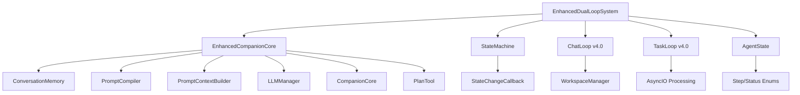

# Enhanced v2.0 コンポーネント分析レポート

**作成日**: 2025-08-20  
**対象**: Enhanced Dual-Loop System v2.0 詳細分析  
**目的**: 依存関係・問題点の特定とリファクタリング方針策定

---

## 📋 **アーキテクチャ概要**

Enhanced v2.0は設計ドキュメント4.4節に基づく状態同期システムを中核とする複雑な統合システムです。

### **システム構成図**


---

## 🔍 **コンポーネント詳細分析**

## **1. EnhancedDualLoopSystem (メインクラス)**

### **責任範囲**
- システム全体の初期化・統合
- 状態同期コールバック管理  
- ChatLoop/TaskLoopの制御
- セッション管理

### **依存関係 (18個)**
```python
# 直接インポート
from .enhanced_core import EnhancedCompanionCore          # 重
from .shared_context_manager import SharedContextManager  # 中
from .chat_loop import ChatLoop                           # 重 (v4.0版)
from .task_loop import TaskLoop                           # 重 (v4.0版)  
from .plan_tool import PlanTool                          # 中
from .file_ops import SimpleFileOps                      # 中
from .simple_approval import ApprovalMode                # 軽
from .state.enums import Step, Status                    # 軽
from .state_machine import StateMachine                  # 重
from .ui import rich_ui                                  # 軽
```

### **問題点**
1. **責任過多**: 初期化・統合・制御・管理を一手に担う
2. **依存関係複雑**: 18個のモジュールに直接依存
3. **状態管理重複**: StateMachineとAgentStateを二重管理
4. **バージョン混在**: v4.0版ChatLoop/TaskLoopを使用

---

## **2. EnhancedCompanionCore (処理中核)**

### **責任範囲**  
- 既存システム（AgentState, ConversationMemory等）との統合
- LLM処理の高度制御
- プロンプト生成・最適化
- 意図理解とタスク実行

### **依存関係 (15個)**
```python
# 既存システムとの統合
from companion.state.agent_state import AgentState               # 重
from .memory.conversation_memory import conversation_memory      # 重
from .prompts.prompt_compiler import prompt_compiler             # 重
from .prompts.context_builder import PromptContextBuilder       # 重
from .base.llm_client import llm_manager                        # 重
from companion.validators.llm_output import LLMOutputFormatter   # 中
from companion.state.agent_state import Step                    # 軽
from companion.prompts.context_assembler import ContextAssembler # 中

# 既存のCompanionCore機能
from .core import CompanionCore, ActionType                     # 重
from .simple_approval import ApprovalMode                       # 軽  
from .shared_context_manager import SharedContextManager        # 中
from .plan_tool import PlanTool, MessageRef                    # 中
```

### **問題点**
1. **既存システム依存**: companion.state, codecrafterへの深い依存
2. **循環参照リスク**: 相互インポートによる初期化問題
3. **状態分散**: AgentStateとCompanionCore両方で状態管理
4. **統合複雑性**: 異なる設計のシステムを無理やり統合

---

## **3. StateMachine (状態管理)**

### **責任範囲**
- Step/Statusの遷移管理
- 許可遷移表による制御
- 状態変更履歴の記録
- コールバック機能

### **設計ドキュメント対応**
| 機能 | 実装状況 | 品質 |
|-----|---------|-----|
| 許可遷移表 | ✅ 実装済み | 🟢 良好 |
| 1発話1遷移制限 | ✅ 実装済み | 🟢 良好 |
| コールバック同期 | ✅ 実装済み | 🟡 普通 |
| エラー復旧 | ✅ 実装済み | 🟡 普通 |

### **問題点**
1. **AgentStateとの重複**: 同じ情報を二箇所で管理
2. **同期タイミング**: コールバックによる非同期更新のリスク
3. **複雑性**: 単純な状態管理に過度な機能

---

## **4. ChatLoop/TaskLoop (v4.0版使用)**

### **問題点**
1. **設計不整合**: Enhanced v2.0の状態管理と非互換
2. **機能不足**: Enhanced機能（記憶要約、高度プロンプト等）未対応  
3. **依存関係競合**: v4.0版の依存関係がEnhanced v2.0と競合

---

## 🚨 **重大問題点まとめ**

### **1. 状態管理の二重化**
```python
# 問題のあるアーキテクチャ  
EnhancedDualLoopSystem:
    self.state_machine = StateMachine()                    # 状態管理A
    self.enhanced_companion = EnhancedCompanionCore()      # 内部にAgentState
    self.agent_state = self.enhanced_companion.get_agent_state()  # 状態管理B
    
    # 同期が必要
    self.state_machine.add_state_change_callback(self._sync_state_to_agent_state)
```

**影響**: 状態不整合、同期エラー、デバッグ困難性

### **2. 循環参照の危険性**
```python
# 危険な依存関係
enhanced_dual_loop.py 
    → enhanced_core.py 
        → companion.state.agent_state.py
            → companion.prompts.context_assembler.py
                → companion.enhanced_core.py  # 循環!
```

**影響**: インポートエラー、初期化失敗、予期しない動作

### **3. バージョン混在問題**
```python
# 設計不整合
EnhancedDualLoopSystem (v2.0設計)
├── Enhanced状態同期システム
└── ChatLoop/TaskLoop (v4.0 Final設計)  # 不整合!
    ├── 簡素な状態管理
    └── WorkspaceManager直接統合
```

**影響**: 機能不整合、設定競合、予期しない動作停止

---

## 🎯 **コンポーネント別リファクタリング方針**

## **Level 1: 緊急対応 (即座実行)**

### **1.1 状態管理統一**
**現在の問題**:
```python
# 二重状態管理
StateMachine.current_step/current_status     # 状態A
AgentState.step/status                       # 状態B (同じ情報)
```

**統一方針**:
```python
# Option A: StateMachine削除、AgentState一本化
class EnhancedDualLoopSystem:
    def __init__(self):
        self.enhanced_companion = EnhancedCompanionCore()
        self.agent_state = self.enhanced_companion.get_agent_state()  # 唯一の状態
        # StateMachine削除
        
# Option B: AgentState削除、StateMachine一本化  
class EnhancedDualLoopSystem:
    def __init__(self):
        self.state_machine = StateMachine()  # 唯一の状態
        # AgentState削除、StateMachineから状態取得
```

**推奨**: Option A (AgentState一本化) - 設計ドキュメント準拠

### **1.2 循環参照解消**
**対策**:
```python
# 依存関係の方向統一
Core Layer (最下層)
├── AgentState
├── Step/Status enums  
└── 基本ユーティリティ

Processing Layer (中間層)
├── EnhancedCompanionCore
├── PromptCompiler
└── LLMManager  

System Layer (最上層)  
├── EnhancedDualLoopSystem
├── ChatLoop  
└── TaskLoop
```

## **Level 2: 構造改善 (安定化後)**

### **2.1 EnhancedCompanionCore分割**
**現在の問題**: 単一クラスに15個の機能を統合

**分割方針**:
```python
# 機能別分割
├── CoreProcessor (基本処理)
│   ├── 意図理解
│   ├── タスク実行  
│   └── 基本応答
├── PromptManager (プロンプト管理)
│   ├── PromptCompiler統合
│   ├── コンテキスト構築
│   └── テンプレート管理
├── MemoryManager (記憶管理)
│   ├── ConversationMemory統合
│   ├── 自動要約
│   └── 履歴管理
└── StateManager (状態管理)
    ├── AgentState統合
    ├── 状態更新
    └── 状態同期
```

### **2.2 Enhanced専用ChatLoop/TaskLoop**
**v4.0版からの完全分離**:
```python
# companion/enhanced/chat_loop.py
class EnhancedChatLoop:
    """Enhanced v2.0専用ChatLoop"""
    
    def __init__(self, enhanced_system):
        self.enhanced_system = enhanced_system  # 統一されたシステム参照
        self.agent_state = enhanced_system.agent_state  # 直接参照
        # WorkspaceManager統合維持
        # Enhanced機能完全対応
        
# companion/enhanced/task_loop.py  
class EnhancedTaskLoop:
    """Enhanced v2.0専用TaskLoop"""
    
    def __init__(self, enhanced_system):
        self.enhanced_system = enhanced_system  # 統一されたシステム参照  
        self.agent_state = enhanced_system.agent_state  # 直接参照
        # 高度なタスク処理対応
        # Enhanced機能完全対応
```

## **Level 3: 最適化 (長期)**

### **3.1 パフォーマンス最適化**
- メモリ使用量削減  
- レスポンス速度向上
- 不要な処理削減

### **3.2 機能拡張**
- 設計ドキュメント未実装機能追加
- 新機能の統合
- ユーザビリティ向上

---

## 📊 **リファクタリング優先度マトリックス**

| コンポーネント | 複雑性 | 影響度 | リスク | 優先度 |
|---------------|-------|-------|-------|--------|
| **状態管理統一** | 中 | 高 | 低 | 🔴 最高 |
| **循環参照解消** | 高 | 高 | 中 | 🔴 最高 |
| **ChatLoop/TaskLoop分離** | 中 | 中 | 中 | 🟡 高 |
| **EnhancedCore分割** | 高 | 中 | 高 | 🟡 中 |
| **パフォーマンス最適化** | 中 | 低 | 低 | 🟢 低 |

---

## 📋 **実装ロードマップ**

### **Week 1: 緊急対応**
- [ ] 状態管理統一（AgentState一本化）
- [ ] 循環参照調査・解消  
- [ ] 基本動作確認・テスト

### **Week 2-3: 構造改善**  
- [ ] Enhanced専用ChatLoop/TaskLoop作成
- [ ] v4.0版ChatLoop/TaskLoop削除
- [ ] EnhancedCompanionCore分割開始

### **Week 4-6: 安定化**
- [ ] 統合テスト強化
- [ ] エラーハンドリング改善
- [ ] ドキュメント更新

### **Week 7-8: 最適化**
- [ ] パフォーマンス改善
- [ ] 追加機能実装
- [ ] 最終テスト・リリース

**この分析に基づき、Enhanced v2.0を段階的に安定性・保守性の高いシステムに改善できます。**