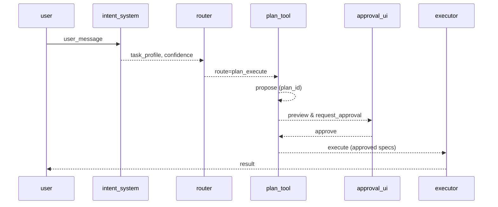

# フロー説明用ドキュメント生成システム 設計案（Duckflow）

## 概要
- 単一真実源である FlowSpec（YAML）から、人間向けの読みやすいフロードキュメント（MD）を機械生成する。
- コード・実行は常に FlowSpec を参照し、PR レビューは生成MD（FlowCard中心）で行う。

## 要求仕様
- 入力: `flowspec/<flow_id>.yaml`（機械可読のフロー仕様）
- 出力: `docs/flows/<flow_id>.md`（人間向け 1〜2 ページ）
- 任意出力: `docs/flows/img/<flow_id>.svg`（mermaid/PlantUML 生成）、`docs/flows/<flow_id>.diff.md`（差分要約）
- 品質: 定型文で十分に可読。必要に応じて FlowSpec の短文フィールドで最小限の人手補助。
- CI: FlowSpec 差分があるPRでは生成物が最新であることを必須化。スキーマ検証・参照整合も実施。

## 全体アーキテクチャ
- flowspec（YAML） → compiler（`scripts/compile_flows.py`） → docs（MD, SVG, DIFF）
- 構成要素:
  - スキーマ: `flowspec/schema.json`（必須キー・列挙・参照整合）
  - テンプレート: `scripts/templates/flow_card.md.j2`, `sequence.mmd.j2`, `diff.md.j2`
  - ジェネレータ: `scripts/compile_flows.py`（Jinja2 + PyYAML + jsonschema）
  - 図生成: `mmdc`/PlantUML は任意。CI では mermaid ソースのみでも可。

## FlowSpec スキーマ（最小）
```yaml
id: flow.chat_plan_execute.v1
title: チャット→プラン→承認→実行
version: 1
status: approved   # draft|approved|deprecated
owner: team/companion
scope: 対話からのファイル変更を伴う要求

summary: 対話から安全にファイル変更を実行する標準フロー
rationale: 作成/修正要求を承認制で実行し、監査可能性を確保
human_notes: ''  # 任意の短文。空なら定型文

routing:
  - id: r1
    if: task_profile in [creation, modification] and confidence >= 0.7
    route: plan_execute
    reason: 十分な確信度の作成/修正要求
  - id: r2
    if: task_profile == guidance
    route: direct_response
  - id: r3
    if: else
    route: clarification

steps:
  - id: s1
    name: intent_system.analyze
    actor: intent_system
    inputs: [user_message]
    outputs: [task_profile, confidence]
    hint: 入力を分類し、確信度を算出
  - id: s2
    name: router.route
    actor: router
    inputs: [task_profile, confidence]
    outputs: [route_type]
  - id: s3
    name: plan_tool.propose
    actor: plan_tool
    outputs: [plan_id]
    hint: プラン本文を保存しID発行
  - id: s4
    name: plan_tool.set_action_specs
    actor: plan_tool
    outputs: [validation_report]
  - id: s5
    name: approval_ui.request_and_approve
    actor: approval_ui
    outputs: [approved]
  - id: s6
    name: plan_tool.execute
    actor: executor
    outputs: [result]
  - id: s7
    name: post_report
    actor: system
    outputs: [artifacts, metrics]

approvals:
  high: manual_required
  medium: policy_default
  low: policy_default

error_handling:
  - when: preflight_changed
    redirect: s4
  - when: not_approved
    action: block_and_hint

observability:
  events: [plan_proposed, specs_set, approval_requested, approved, executed, completed]
  log_keys: [flow_id, step_id, plan_id, correlation_id]
  artifacts: [logs/plans/<plan_id>/plan.json]
```

## 生成される人間用ドキュメント（骨子）
- FlowCard（冒頭1画面）: 目的/入口/出口/主役/完了条件/リスク
- Main Path（最大7ステップ）: actor/action/output を1行ずつ
- 分岐とガードレール: Clarification / Approval / Error を3ブロック以内
- 図（mermaid）: steps から sequence を自動生成
- チェックリスト: 実装/レビュー/運用の定型
- 変更履歴: FlowSpec 差分の要約（追加/変更/削除）

### 生成例（mermaid）


## ジェネレータ設計（scripts/compile_flows.py）
- 依存: `PyYAML`, `Jinja2`, `jsonschema`（任意: `mermaid-cli`）
- 処理:
  1) FlowSpec 読込 → スキーマ検証
  2) テンプレ適用 → `docs/flows/<flow_id>.md` 出力
  3) mermaid ソース生成（必要なら SVG に変換）
  4) 直近コミットの FlowSpec と比較し diff 要約を生成（オプション）
- テンプレ: 
  - `flow_card.md.j2`: FlowCard + Main Path + 分岐 + 図 + チェックリスト
  - `sequence.mmd.j2`: sequence 用ソース
  - `diff.md.j2`: 差分要約


- FlowSpec はレビュー必須（CODEOWNERS）。
- 高リスク操作（削除/大規模上書き/外部実行）は FlowSpec に明示、承認ポリシーに反映。
- 生成MDは機械生成で安定化し、差分がレビューしやすい構造を維持。

## 拡張計画
- フロー依存関係・サブフローの参照（FlowSpec 間リンク）。
- 失敗モード影響解析（FMEA）項目の追加と自動要約。

