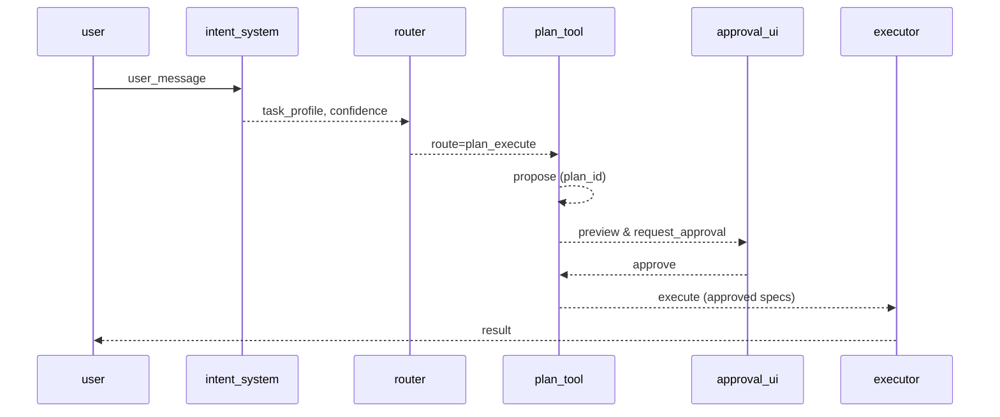

# Flow: チャット→プラン→承認→実行 (`flow.chat_plan_execute.v1`)

| 属性 | 値 |
|---|---|
| **バージョン** | `1` |
| **ステータス** | `approved` |
| **オーナー** | `team/companion` |
| **目的** | `対話から安全にファイル変更を実行する標準フロー` |
| **存在理由** | `作成/修正要求を承認制で実行し、監査可能性を確保` |

---

## メインパス

**1. intent_system.analyze**
- **Actor:** `intent_system`
- **Outputs:** `task_profile, confidence`
- *入力を分類し、確信度を算出*
**2. router.route**
- **Actor:** `router`
- **Outputs:** `route_type`
- **
**3. plan_tool.propose**
- **Actor:** `plan_tool`
- **Outputs:** `plan_id`
- *プラン本文を保存しID発行*
**4. plan_tool.set_action_specs**
- **Actor:** `plan_tool`
- **Outputs:** `validation_report`
- **
**5. approval_ui.request_and_approve**
- **Actor:** `approval_ui`
- **Outputs:** `approved`
- **
**6. plan_tool.execute**
- **Actor:** `executor`
- **Outputs:** `result`
- **
**7. post_report**
- **Actor:** `system`
- **Outputs:** `artifacts, metrics`
- **

---

## 分岐とガードレール

### ルーティング
- **r1:** `task_profile in [creation, modification] and confidence >= 0.7` → `plan_execute` (十分な確信度の作成/修正要求)
- **r2:** `task_profile == guidance` → `direct_response` (理由未定義)
- **r3:** `else` → `clarification` (理由未定義)

### 承認ポリシー
- **High:** `manual_required`
- **Medium:** `policy_default`
- **Low:** `policy_default`

### エラーハンドリング
- **When:** `preflight_changed`, **Action:** `N/A`, **Redirect:** `s4`
- **When:** `not_approved`, **Action:** `block_and_hint`, **Redirect:** `N/A`

---

## シーケンス図

---

## 可観測性

- **Events:** `plan_proposed, specs_set, approval_requested, approved, executed, completed`
- **Log Keys:** `flow_id, step_id, plan_id, correlation_id`
- **Artifacts:** `logs/plans/<plan_id>/plan.json`