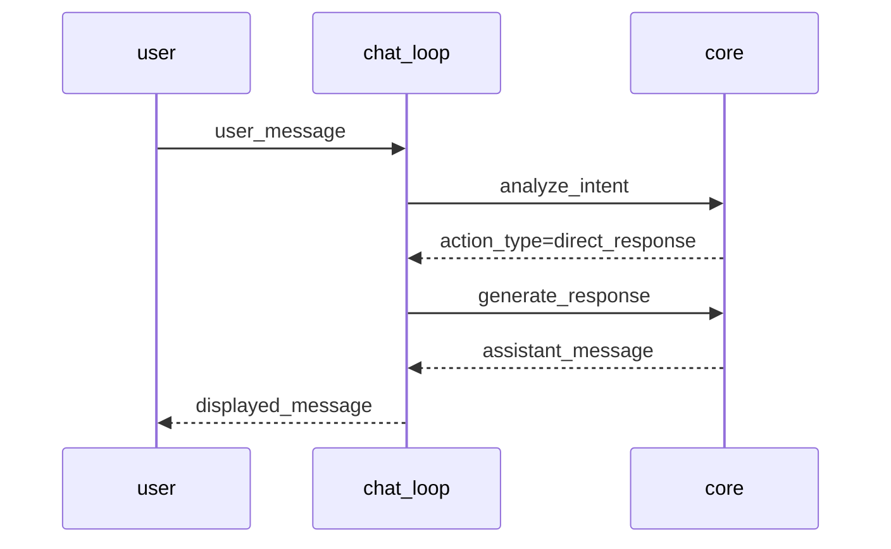

# Flow: 直接応答（DirectResponse） (`flow.direct_response.v1`)

| 属性 | 値 |
|---|---|
| バージョン | 1 |
| ステータス | approved |
| オーナー | team/companion |
| 目的 | ガイダンス/説明などの低リスク応答を素早く返す |
| 概要 | 対話履歴とシステムプロンプトを使って LLM で直接応答を生成し、出力する |

---

## メインパス（4ステップ）
1. receive_user_input（chat_loop）: 入力取得
2. analyze_intent（core）: guidance/direct_response を確認
3. generate_response（core）: LLM で応答生成（履歴20件まで）
4. output_to_user（chat_loop）: 応答表示

---

## 分岐とガードレール
- ルーティング: guidance → direct_response
- 承認: 不要
- エラー: intent 失敗時は fallback で s3 を実行

---

## シーケンス（概略）

---

## 可観測性
- Events: input_received, intent_analyzed, response_generated, flow_completed
- Log Keys: flow_id, step_id, correlation_id, session_id
- Artifacts: logs/sessions/<session_id>/direct_response.log

