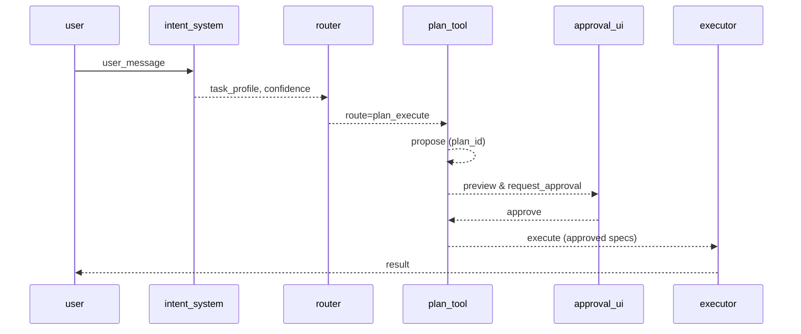

# Flow: フロー説明用ドキュメント生成システム (`flow.docs_generation_system.v1`)

| 属性 | 値 |
|---|---|
| **バージョン** | `1` |
| **ステータス** | `approved` |
| **オーナー** | `team/companion` |
| **目的** | `FlowSpec を基に docs/flows 配下に人間可読なフロー文書を生成する` |
| **存在理由** | `FlowSpec を単一真実源として扱い、ドキュメントの整合性とレビュー効率を向上させる` |

---

## メインパス

**1. load_flowspecs**
- **Actor:** `compile_flows`
- **Outputs:** `flow_files`
- *FlowSpec ディレクトリから *.yaml を取得*
**2. load_templates**
- **Actor:** `compile_flows`
- **Outputs:** `flow_card_template, sequence_template`
- *Jinja2 テンプレートをロード*
**3. render_sequence_diagram**
- **Actor:** `compile_flows`
- **Outputs:** `mermaid_diagram`
- *Mermaid シーケンス図を生成*
**4. render_flow_card**
- **Actor:** `compile_flows`
- **Outputs:** `flow_md_content`
- *FlowCard（概要・ステップ・分岐・観測情報）を Markdown にレンダリング*
**5. write_output**
- **Actor:** `compile_flows`
- **Outputs:** `output_file`
- *docs/flows/<flow_id>.md に書き出し*

---

## 分岐とガードレール

### ルーティング

### 承認ポリシー
- **High:** `manual_required`
- **Medium:** `policy_default`
- **Low:** `policy_default`

### エラーハンドリング
- **When:** `no_flowspecs_found`, **Action:** `abort`, **Redirect:** `N/A`
- **When:** `template_missing`, **Action:** `abort`, **Redirect:** `N/A`

---

## シーケンス図

---

## 可観測性

- **Events:** `compile_started, flow_processed, compile_completed`
- **Log Keys:** `flow_id, file_name`
- **Artifacts:** `docs/flows/<flow_id>.md`