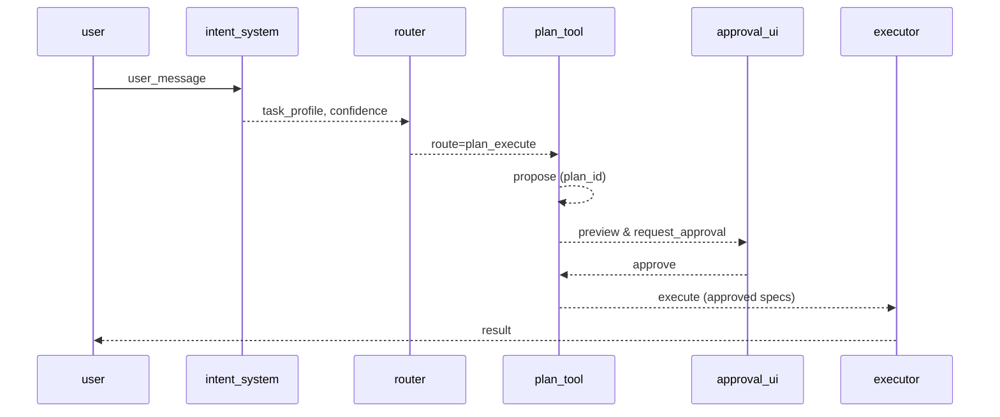

# Flow: Duckflow チャット入力・ファイル操作・応答生成フロー (`flow.duckflow_chat_flow.v1`)

| 属性 | 値 |
|---|---|
| **バージョン** | `1` |
| **ステータス** | `approved` |
| **オーナー** | `team/companion` |
| **目的** | `ユーザーからのメッセージを受け取り、意図を解析し、適切なアクション（直接応答・ファイル操作・コード実行・複数ステップタスク）を実行して応答を生成する` |
| **存在理由** | `Duckflow が「相棒」としてユーザーと継続的に対話しつつ、ファイル操作やコード実行などのタスクを安全に実行できるようにするための標準フロー` |

---

## メインパス

**1. receive_user_input**
- **Actor:** `chat_loop`
- **Outputs:** `raw_input`
- *ユーザーからのテキスト入力を取得*
**2. analyze_intent**
- **Actor:** `core`
- **Outputs:** `action_type, intent_result`
- *IntentUnderstandingSystem で意図を解析し ActionType を決定*
**3. dispatch_action**
- **Actor:** `core`
- **Outputs:** `action_result`
- *ActionType に応じて DirectResponse / FileOperation / CodeExecution / MultiStepTask を実行*
**4. generate_response**
- **Actor:** `core`
- **Outputs:** `assistant_message`
- *実行結果を元に自然な応答メッセージを生成*
**5. output_to_user**
- **Actor:** `chat_loop`
- **Outputs:** `displayed_message`
- *Rich UI でユーザーに応答を表示*

---

## 分岐とガードレール

### ルーティング

### 承認ポリシー
- **High:** `manual_required`
- **Medium:** `policy_default`
- **Low:** `policy_default`

### エラーハンドリング
- **When:** `intent_analysis_failed`, **Action:** `abort`, **Redirect:** `N/A`
- **When:** `file_operation_failed`, **Action:** `request_clarification`, **Redirect:** `s2`
- **When:** `code_execution_failed`, **Action:** `request_clarification`, **Redirect:** `s2`
- **When:** `unknown_action_type`, **Action:** `fallback_direct_response`, **Redirect:** `s4`

---

## シーケンス図

---

## 可観測性

- **Events:** `input_received, intent_analyzed, action_dispatched, response_generated, flow_completed`
- **Log Keys:** `session_id, user_message, action_type`
- **Artifacts:** `logs/sessions/<session_id>/flow.log`