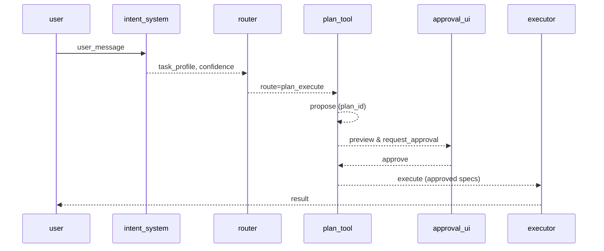

# Flow: ダミーフロー (`flow.dummy.v1`)

| 属性 | 値 |
|---|---|
| **バージョン** | `1` |
| **ステータス** | `draft` |
| **オーナー** | `team/test` |
| **目的** | `これはテスト用のダミーのフローです。` |
| **存在理由** | `複数のファイルが処理されるか確認するために存在します。` |

---

## メインパス

**1. dummy.step**
- **Actor:** `dummy_actor`
- **Outputs:** `dummy_output`
- *ダミーのステップです。*

---

## 分岐とガードレール

### ルーティング

### 承認ポリシー
- **High:** `manual_required`
- **Medium:** ``
- **Low:** ``

### エラーハンドリング

---

## シーケンス図

---

## 可観測性

- **Events:** `dummy_event`
- **Log Keys:** `flow_id`
- **Artifacts:** ``