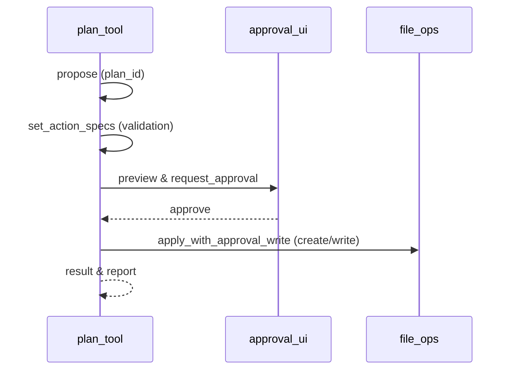

# Flow: ファイル操作（プラン→承認→実行） (`flow.file_operation.v1`)

| 属性 | 値 |
|---|---|
| バージョン | 1 |
| ステータス | approved |
| オーナー | team/companion |
| 目的 | 作成/修正要求を安全に適用（監査/承認/再承認） |
| 概要 | PlanTool を単一真実源に、プラン提示→明細→承認→実行→記録の順で処理する |

---

## メインパス（5ステップ）
1. plan_tool.propose: プラン保存（plan_id）
2. plan_tool.set_action_specs: 明細/バリデーション/プレフライト
3. approval_ui.request_and_approve: プレビューと承認（高リスクは手動）
4. plan_tool.execute: SimpleFileOps の承認付き書き込みで適用
5. post_report: logs/plans/<plan_id>/plan.json に保存

---

## 分岐とガードレール
- ルーティング: creation/modification → plan_execute
- 承認: high=manual_required / medium&low=policy_default
- エラー: preflight 変化→ s2 に戻す、未承認→実行不可

---

## シーケンス（概略）

---

## 可観測性
- Events: plan_proposed, specs_set, approval_requested, approved, executed, completed
- Log Keys: flow_id, step_id, plan_id, correlation_id
- Artifacts: logs/plans/<plan_id>/plan.json

