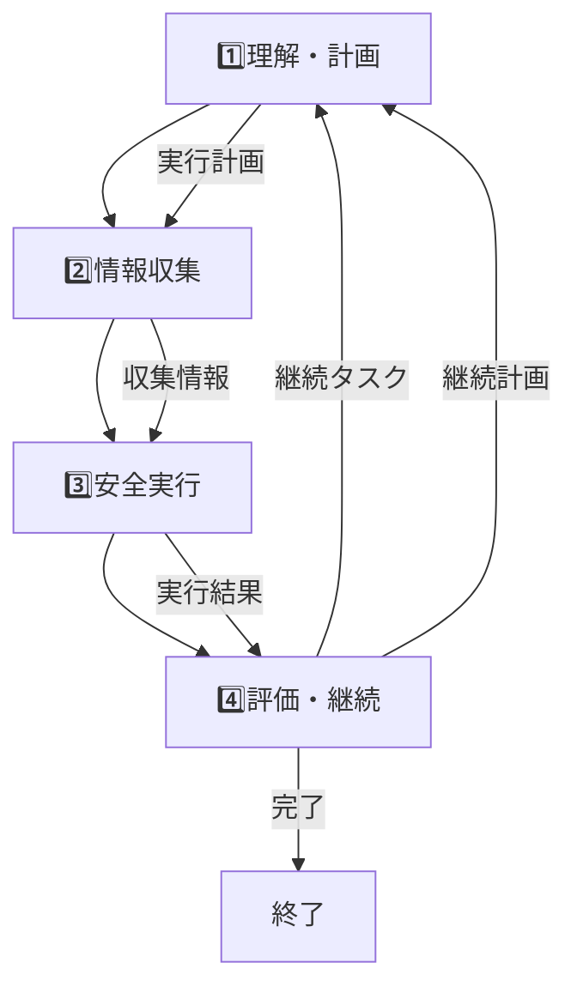

# 4ノード統合アーキテクチャ移行計画

**バージョン**: 1.0  
**作成日**: 2025-01-09  
**目的**: 7ノード→4ノードへの統合による性能改善と情報伝達ロス解消

## 📋 概要

### 現在の問題
- **情報伝達ロス**: 7ノード間での文脈断絶
- **過度な複雑性**: デバッグ困難、応答時間の長期化
- **静的なプロンプト生成**: ノードの役割を考慮しない硬直的な処理

### 解決アプローチ  
- **4ノード統合**: 論理的に関連する処理を統合
- **動的文脈継承**: 各段階の結果を次段階で確実に利用
- **ノード特化プロンプト**: 各ノードの役割に最適化されたプロンプト生成

---

## 🎯 4ノードアーキテクチャ設計

### 現在の7ノード → 新しい4ノード

```
【現在】7ノード（複雑）:
思考 → コンテキスト収集 → 危険性評価 → 人間承認 → ツール実行 → 結果確認 → エラー分析

【新設計】4ノード（シンプル）:
1️⃣ 理解・計画    2️⃣ 情報収集    3️⃣ 安全実行    4️⃣ 評価・継続
```

### 各ノードの詳細設計

#### 1️⃣ 理解・計画ノード (Understanding & Planning)
- **役割**: ユーザー要求の深い理解、実行戦略の立案
- **統合する旧ノード**: 思考ノード（要求理解部分）
- **入力**: ユーザーメッセージ、対話履歴・記憶要約、前回の継続タスク情報
- **出力**: 構造化された要求理解、実行計画、予想リスクレベル

#### 2️⃣ 情報収集ノード (Information Gathering)
- **役割**: 計画に基づいた情報収集、プロジェクト文脈の構築
- **統合する旧ノード**: コンテキスト収集ノード
- **入力**: 計画ノードの「必要な情報」リスト、現在のワークスペース状態
- **出力**: 収集ファイル内容、RAG検索結果、プロジェクト理解、信頼度情報

#### 3️⃣ 安全実行ノード (Safe Execution)
- **役割**: リスク評価 + 人間承認 + ツール実行の統合処理
- **統合する旧ノード**: 危険性評価、人間承認、ツール実行ノード
- **入力**: 実行計画、収集された文脈情報、対象ファイル情報
- **出力**: リスク評価結果、承認判断記録、ツール実行結果、実行時エラー

#### 4️⃣ 評価・継続ノード (Evaluation & Continuation)
- **役割**: 実行結果の評価、エラー分析、次ステップ決定
- **統合する旧ノード**: 結果確認、エラー分析ノード
- **入力**: ツール実行結果、元の実行計画、期待される成果
- **出力**: 成功/失敗判定、エラー原因分析、修正提案、継続タスク計画

### 4ノード間の情報フロー



---

## 🔧 PromptContext設計変更

### 現在の問題
```python
# 現在：情報が分散・断絶
@dataclass(frozen=True)
class PromptContext:
    template_name: str  # 静的選択
    workspace_path: str
    recent_messages: List[ConversationMessage]  # 制限された履歴
    file_context: Optional[FileContext] = None  # 軽量版のみ
    rag_context: Optional[RAGContext] = None  # 切り詰められた情報
```

### 新設計：4ノード対応PromptContext
```python
@dataclass
class FourNodePromptContext:
    """4ノード対応の文脈継承PromptContext"""
    
    # 🎯 ノード識別情報
    current_node: NodeType  # UNDERSTANDING, GATHERING, EXECUTION, EVALUATION
    execution_phase: int  # 実行回数（再試行対応）
    
    # 📊 段階別蓄積情報
    understanding: Optional[UnderstandingResult] = None    # 1️⃣の結果
    gathered_info: Optional[GatheredInfo] = None          # 2️⃣の結果  
    execution_result: Optional[ExecutionResult] = None    # 3️⃣の結果
    evaluation: Optional[EvaluationResult] = None         # 4️⃣の結果
    
    # 🔄 継続性情報
    task_chain: List[TaskStep] = field(default_factory=list)  # タスクの連鎖
    retry_context: Optional[RetryContext] = None              # 再試行時の文脈
    
    # ⚙️ 動的設定
    token_budget: int = 6000  # 4ノードなのでより多く配分
    node_priorities: Dict[str, float] = field(default_factory=dict)

# 各段階の結果データクラス
@dataclass
class UnderstandingResult:
    """理解・計画ノードの出力"""
    requirement_analysis: str
    execution_plan: ExecutionPlan
    identified_risks: List[str]
    information_needs: List[str]

@dataclass 
class GatheredInfo:
    """情報収集ノードの出力"""
    collected_files: Dict[str, FileContent]
    rag_results: List[RAGResult]
    project_context: ProjectContext
    confidence_scores: Dict[str, float]

@dataclass
class ExecutionResult:
    """安全実行ノードの出力"""
    risk_assessment: RiskAssessment
    approval_status: ApprovalStatus
    tool_results: List[ToolResult]
    execution_errors: List[ExecutionError]

@dataclass
class EvaluationResult:
    """評価・継続ノードの出力"""
    success_status: bool
    error_analysis: Optional[ErrorAnalysis]
    next_action: NextAction  # COMPLETE, CONTINUE, RETRY
    continuation_plan: Optional[ExecutionPlan]
```

---

## 🎛️ PromptCompiler設計変更

### 現在の問題
```python
# 現在：静的で硬直的
def compile_system_prompt_dto(self, context: PromptContext) -> str:
    template_name = context.template_name  # 固定テンプレート選択
    if template_name == "system_base":     # 分岐が少ない
        return self._render_base_template(context)
```

### 新設計：4ノード専用PromptCompiler
```python
class FourNodePromptCompiler:
    """4ノード特化型プロンプトコンパイラ"""
    
    def compile_node_prompt(self, context: FourNodePromptContext) -> str:
        """ノードごとの最適化プロンプト生成"""
        
        match context.current_node:
            case NodeType.UNDERSTANDING:
                return self._compile_understanding_prompt(context)
            case NodeType.GATHERING:
                return self._compile_gathering_prompt(context)
            case NodeType.EXECUTION:
                return self._compile_execution_prompt(context)
            case NodeType.EVALUATION:
                return self._compile_evaluation_prompt(context)
    
    def _compile_understanding_prompt(self, context: FourNodePromptContext) -> str:
        """理解・計画ノード専用プロンプト"""
        
        # 継続タスクか新規タスクかで分岐
        if context.retry_context:
            base_template = "understanding_retry"
            previous_failure = context.retry_context.failure_analysis
        else:
            base_template = "understanding_fresh" 
            previous_failure = None
            
        return self._render_template(
            template_name=base_template,
            user_message=context.task_chain[-1].user_message,
            previous_failure=previous_failure,
            workspace_overview=self._get_workspace_summary(context),
            token_limit=context.token_budget // 4  # 1/4を割り当て
        )
    
    def _compile_gathering_prompt(self, context: FourNodePromptContext) -> str:
        """情報収集ノード専用プロンプト"""
        
        understanding = context.understanding
        if not understanding:
            raise ValueError("理解ノードの結果が必要")
            
        return self._render_template(
            template_name="gathering_focused",
            execution_plan=understanding.execution_plan,
            information_needs=understanding.information_needs,
            current_workspace=self._get_current_files(context),
            rag_hints=self._prepare_rag_hints(understanding),
            token_limit=context.token_budget // 2  # 1/2を割り当て（情報量多い）
        )
    
    def _compile_execution_prompt(self, context: FourNodePromptContext) -> str:
        """安全実行ノード専用プロンプト"""
        
        understanding = context.understanding
        gathered_info = context.gathered_info
        if not (understanding and gathered_info):
            raise ValueError("理解・収集ノードの結果が必要")
            
        return self._render_template(
            template_name="execution_safe",
            execution_plan=understanding.execution_plan,
            collected_context=gathered_info.collected_files,
            risk_factors=understanding.identified_risks,
            project_context=gathered_info.project_context,
            approval_criteria=self._get_approval_criteria(understanding),
            token_limit=context.token_budget // 6  # 1/6を割り当て（実行は簡潔）
        )
    
    def _compile_evaluation_prompt(self, context: FourNodePromptContext) -> str:
        """評価・継続ノード専用プロンプト"""
        
        # 全ての前段階情報を統合
        return self._render_template(
            template_name="evaluation_comprehensive",
            original_plan=context.understanding.execution_plan,
            execution_results=context.execution_result.tool_results,
            expected_outcome=context.understanding.requirement_analysis,
            error_context=context.execution_result.execution_errors,
            token_limit=context.token_budget // 6  # 1/6を割り当て
        )
```

### 新しいテンプレート構造
```yaml
# 4ノード専用テンプレート
templates:
  understanding_fresh:
    role: "要求理解・計画立案の専門家"
    focus: "ユーザーの真のニーズを理解し、実行可能な計画を作成"
    
  understanding_retry: 
    role: "失敗分析・再計画の専門家"
    focus: "前回の失敗原因を踏まえた改善計画の作成"
    
  gathering_focused:
    role: "情報収集の専門家" 
    focus: "計画に必要な情報を効率的に収集"
    
  execution_safe:
    role: "安全実行の専門家"
    focus: "リスクを評価し、承認を得て、確実に実行"
    
  evaluation_comprehensive:
    role: "結果評価・継続判断の専門家"
    focus: "実行結果を総合評価し、次の最適なアクションを決定"
```

---

## 🚀 段階的実装プラン（3段階）

### Phase 1: データ構造とテンプレート準備（1週間）

#### Step 1-1: データクラス実装
- **新ファイル**: `codecrafter/prompts/four_node_context.py`
  - FourNodePromptContext
  - UnderstandingResult, GatheredInfo, ExecutionResult, EvaluationResult
  - NodeType, NextAction等のEnum

#### Step 1-2: テンプレート作成
- **新ファイル**: `codecrafter/prompts/system_prompts/four_node_templates.yaml`
  - understanding_fresh, understanding_retry
  - gathering_focused
  - execution_safe  
  - evaluation_comprehensive

#### Step 1-3: 新PromptCompiler実装
- **新ファイル**: `codecrafter/prompts/four_node_compiler.py`
  - FourNodePromptCompiler
  - 各ノード専用のコンパイル関数
  - トークン配分ロジック

### Phase 2: 4ノードオーケストレーター実装（2週間）

#### Step 2-1: 新グラフ構築
- **変更ファイル**: `codecrafter/orchestration/graph_orchestrator.py`
  - 既存7ノード → 4ノードに統合
  - 新しい条件分岐ロジック
  - FourNodePromptContextとの統合

#### Step 2-2: 各ノード実装
```python
def _understanding_node(self, state: AgentState) -> AgentState:
    """理解・計画ノード（旧:思考ノード）"""

def _gathering_node(self, state: AgentState) -> AgentState:
    """情報収集ノード（旧:コンテキスト収集）"""
    
def _execution_node(self, state: AgentState) -> AgentState:
    """安全実行ノード（旧:危険性評価+人間承認+ツール実行）"""
    
def _evaluation_node(self, state: AgentState) -> AgentState:
    """評価・継続ノード（旧:結果確認+エラー分析）"""
```

#### Step 2-3: フロー制御実装
- 理解→収集（常に）
- 収集→実行（情報が十分な場合）
- 実行→評価（常に）
- 評価→理解（継続の場合）/終了（完了の場合）

### Phase 3: テストと調整（1週間）

#### Step 3-1: ユニットテスト
```python
# テストファイル群
tests/prompts/test_four_node_context.py
tests/prompts/test_four_node_compiler.py  
tests/orchestration/test_four_node_graph.py
```

#### Step 3-2: 統合テスト
- 単純なファイル読み取りタスク
- 複数ファイル編集タスク
- エラー修正・再試行タスク
- プロジェクト理解が必要なタスク

#### Step 3-3: パフォーマンス比較
- 応答時間（7ノード vs 4ノード）
- LLM呼び出し回数
- タスク完了率
- 情報伝達の精度

---

## 🧪 テスト戦略

### レベル1: 基本機能テスト
```python
def test_simple_file_read():
    """単純なファイル読み取り（1回のループ）"""
    # 理解→収集→実行→評価で完了
    
def test_file_modification():
    """ファイル変更（承認プロセス含む）"""  
    # 理解→収集→実行（承認）→評価で完了
```

### レベル2: 複雑なタスクテスト
```python
def test_multi_file_refactoring():
    """複数ファイルのリファクタリング"""
    # 複数回のループが必要
    
def test_error_recovery():
    """エラー発生→修正→再実行"""
    # retry_contextを使った再試行
```

### レベル3: 文脈継承テスト
```python
def test_context_inheritance():
    """情報がノード間で正しく継承される"""
    
def test_token_budget_management():
    """トークン制限内での情報優先度制御"""
```

---

## 📊 期待される効果

### 定量的効果
- **LLM呼び出し回数**: 最大7回 → 最大4回（43%削減）
- **平均応答時間**: 推定30-40%短縮
- **デバッグ容易性**: 分岐数大幅削減

### 定性的効果  
- **理解しやすいフロー**: 4段階の明確な処理
- **情報継承の確実性**: 各段階の結果を次段階で確実に利用
- **拡張性**: 必要に応じて新ノードを追加可能

---

## 📅 実装タイムライン

| 期間 | フェーズ | 主要成果物 | 担当者 |
|------|----------|------------|--------|
| Week 1 | Phase 1 | データクラス、テンプレート、新Compiler | 開発者 |
| Week 2-3 | Phase 2 | 4ノードオーケストレーター実装 | 開発者 |
| Week 4 | Phase 3 | テスト、性能評価、調整 | 開発者 |

## 🎯 成功基準

1. **機能**: 現在の7ノード機能と同等以上
2. **性能**: 応答時間30%以上改善
3. **品質**: 複雑なタスクの成功率向上
4. **保守性**: コード理解とデバッグの容易性向上

---

**このプランに基づいて、段階的に4ノード統合を実施し、Duckflowの実用性を大幅に向上させる。**