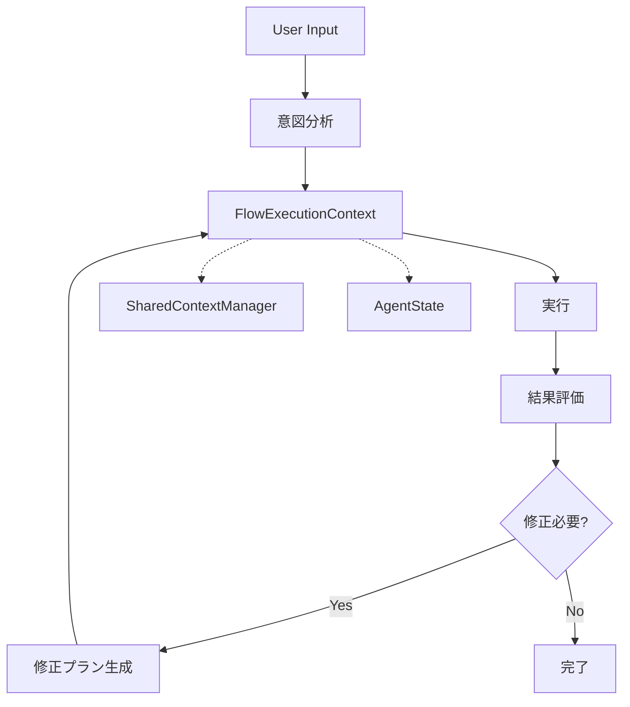

# フロー間コンテキスト共有機能 実装プラン

**バージョン:** 1.0  
**作成日:** 2025年8月17日  
**対象:** 自己修正ループ実装のための情報共有基盤整備  

## 1. 概要

### 1.1. 目的
現在のDuckflow companionシステムにおいて、自己修正ループ（実行→評価→修正→再実行）を実現するために必要な**構造化された情報共有機能**を実装する。

### 1.2. 現状の課題
- 意図分析結果が実行コンポーネントに構造的に共有されていない
- 実行結果の詳細コンテキストが次の試行に引き継がれていない
- エラー回復に必要な学習データが蓄積・活用されていない
- SharedContextManagerの活用が基本的なステータス共有に留まっている

### 1.3. 解決方針
既存のSharedContextManagerとAgentStateを拡充し、最小限の変更で最大限の効果を得る。

## 2. 実装アーキテクチャ

### 2.1. 全体構成



### 2.2. コンポーネント設計

#### **FlowExecutionContext** (新規実装)
実行コンテキストの構造化管理

```python
@dataclass
class FlowExecutionContext:
    """フロー実行コンテキスト"""
    # 基本情報
    flow_id: str
    session_id: str
    correlation_id: str
    
    # 意図分析結果
    intent_analysis: Optional[IntentResult] = None
    
    # 実行履歴
    execution_history: List[ExecutionStep] = field(default_factory=list)
    
    # 現在の状態
    current_step: str = ""
    iteration_count: int = 0
    
    # 学習データ
    accumulated_learnings: List[str] = field(default_factory=list)
    error_patterns: List[ErrorPattern] = field(default_factory=list)
    
    # メタデータ
    created_at: datetime = field(default_factory=datetime.now)
    last_updated: datetime = field(default_factory=datetime.now)

@dataclass 
class ExecutionStep:
    """実行ステップ"""
    step_id: str
    step_type: str  # "intent_analysis", "execution", "evaluation", "correction"
    inputs: Dict[str, Any]
    outputs: Dict[str, Any]
    success: bool
    error_message: Optional[str] = None
    execution_time: float = 0.0
    timestamp: datetime = field(default_factory=datetime.now)

@dataclass
class IntentResult:
    """意図分析結果"""
    task_profile: str
    confidence: float
    action_type: str
    risk_level: str
    routing_decision: str
```

#### **EnhancedContextManager** (拡張実装)
SharedContextManagerの拡張版

```python
class EnhancedContextManager(SharedContextManager):
    """拡張コンテキスト管理"""
    
    def __init__(self):
        super().__init__()
        self.execution_contexts: Dict[str, FlowExecutionContext] = {}
        self.context_history: List[Dict[str, Any]] = []
    
    def create_execution_context(self, session_id: str, correlation_id: str) -> FlowExecutionContext:
        """新しい実行コンテキストを作成"""
        context = FlowExecutionContext(
            flow_id=f"flow_{correlation_id}",
            session_id=session_id,
            correlation_id=correlation_id
        )
        self.execution_contexts[correlation_id] = context
        return context
    
    def update_execution_step(self, correlation_id: str, step: ExecutionStep) -> None:
        """実行ステップを追加"""
        if correlation_id in self.execution_contexts:
            context = self.execution_contexts[correlation_id]
            context.execution_history.append(step)
            context.last_updated = datetime.now()
            
            # SharedContextManagerにも反映
            self.update_context(f"execution_step_{correlation_id}", step)
    
    def get_execution_context(self, correlation_id: str) -> Optional[FlowExecutionContext]:
        """実行コンテキストを取得"""
        return self.execution_contexts.get(correlation_id)
    
    def should_continue_correction_loop(self, correlation_id: str) -> bool:
        """修正ループ継続判定"""
        context = self.get_execution_context(correlation_id)
        if not context:
            return False
        
        # 最大3回まで試行
        if context.iteration_count >= 3:
            return False
        
        # 最近の実行結果を確認
        recent_steps = context.execution_history[-3:] if context.execution_history else []
        failed_steps = [step for step in recent_steps if not step.success]
        
        return len(failed_steps) > 0
```

## 3. 実装ステップ

### 3.1. Phase 1: 基盤整備 (1-2日)

#### **Step 1.1: FlowExecutionContext実装**
- `companion/context/flow_execution_context.py` 新規作成
- 上記データクラス群の実装
- 基本的なCRUD操作の実装

#### **Step 1.2: EnhancedContextManager実装**
- `companion/enhanced_context_manager.py` 新規作成
- SharedContextManagerの拡張
- 実行コンテキスト管理機能の追加

#### **Step 1.3: 既存システムとの統合準備**
- `companion/enhanced_dual_loop.py` の改修準備
- `companion/enhanced_core.py` の統合ポイント特定

### 3.2. Phase 2: 意図分析結果共有 (1日)

#### **Step 2.1: IntentResult構造化**
- 意図分析結果の標準化
- EnhancedCompanionCore.analyze_intent_only() の出力を構造化

#### **Step 2.2: 意図結果の伝播**
```python
async def analyze_and_share_intent(self, user_message: str, context: FlowExecutionContext) -> IntentResult:
    """意図分析と結果共有"""
    # 既存の意図分析
    intent_data = await self.analyze_intent_only(user_message)
    
    # 構造化
    intent_result = IntentResult(
        task_profile=intent_data.get('task_profile', 'unknown'),
        confidence=intent_data.get('confidence', 0.0),
        action_type=intent_data.get('action_type', 'unknown'),
        risk_level=intent_data.get('risk_level', 'medium'),
        routing_decision=intent_data.get('route_type', 'clarification')
    )
    
    # コンテキストに保存
    context.intent_analysis = intent_result
    
    # SharedContextManagerにも反映
    self.enhanced_context.update_context('current_intent', intent_result)
    
    return intent_result
```

### 3.3. Phase 3: 実行結果コンテキスト (1-2日)

#### **Step 3.1: ExecutionStep追跡**
- ファイル操作、LLM呼び出し等の実行ステップを構造化
- 成功/失敗の詳細記録
- エラーメッセージとコンテキストの保持

#### **Step 3.2: 実行結果の評価**
```python
def evaluate_execution_result(self, context: FlowExecutionContext, result: Any) -> ExecutionStep:
    """実行結果の評価"""
    step = ExecutionStep(
        step_id=f"exec_{len(context.execution_history)}",
        step_type="execution",
        inputs={"user_request": context.intent_analysis},
        outputs={"result": result},
        success=self._is_successful(result),
        error_message=self._extract_error_message(result)
    )
    
    # 失敗パターンの学習
    if not step.success:
        error_pattern = self._analyze_error_pattern(step, context)
        context.error_patterns.append(error_pattern)
    
    return step
```

### 3.4. Phase 4: 自己修正ループ統合 (1-2日)

#### **Step 4.1: 修正判定ロジック**
```python
def should_attempt_correction(self, context: FlowExecutionContext) -> bool:
    """修正試行判定"""
    if context.iteration_count >= 3:
        return False
    
    last_step = context.execution_history[-1] if context.execution_history else None
    if not last_step or last_step.success:
        return False
    
    # 修正可能なエラーかチェック
    return self._is_correctable_error(last_step.error_message)
```

#### **Step 4.2: 修正プラン生成**
```python
async def generate_correction_plan(self, context: FlowExecutionContext) -> str:
    """修正プラン生成"""
    error_history = [step for step in context.execution_history if not step.success]
    learning_context = {
        "previous_errors": error_history,
        "error_patterns": context.error_patterns,
        "accumulated_learnings": context.accumulated_learnings
    }
    
    # LLMを使用して修正プラン生成
    correction_plan = await self._generate_correction_with_llm(learning_context)
    
    # 学習データに追加
    context.accumulated_learnings.append(f"Correction attempt {context.iteration_count}: {correction_plan}")
    
    return correction_plan
```

## 4. 既存システムとの統合

### 4.1. EnhancedDualLoop統合
```python
class EnhancedDualLoopSystem:
    def __init__(self):
        self.enhanced_context = EnhancedContextManager()
        # ... 既存初期化
    
    async def execute_with_correction_loop(self, user_message: str) -> str:
        """修正ループ付き実行"""
        correlation_id = str(uuid.uuid4())
        context = self.enhanced_context.create_execution_context(
            session_id=self.session_id,
            correlation_id=correlation_id
        )
        
        # 意図分析
        intent_result = await self.analyze_and_share_intent(user_message, context)
        
        # 修正ループ
        while context.iteration_count < 3:
            try:
                # 実行
                result = await self.execute_task(context)
                
                # 評価
                step = self.evaluate_execution_result(context, result)
                self.enhanced_context.update_execution_step(correlation_id, step)
                
                if step.success:
                    return result
                
                # 修正判定
                if not self.should_attempt_correction(context):
                    break
                
                # 修正プラン生成と再試行
                correction_plan = await self.generate_correction_plan(context)
                context.iteration_count += 1
                
            except Exception as e:
                # エラー処理
                break
        
        return "修正ループ完了: 改善できませんでした"
```

### 4.2. AgentState連携
- 実行コンテキストをAgentStateに定期的に同期
- 長期記憶として成功/失敗パターンを保存
- ConversationMemoryとの統合

## 5. テスト戦略

### 5.1. 単体テスト
- FlowExecutionContextの基本操作
- EnhancedContextManagerの並行処理
- 意図分析結果の構造化

### 5.2. 統合テスト
- 修正ループの実行
- エラーパターンの学習
- AgentStateとの同期

### 5.3. E2Eテスト
```python
async def test_self_correction_loop():
    """自己修正ループのE2Eテスト"""
    # 失敗するタスクを用意
    user_message = "存在しないファイルを読んで内容を要約して"
    
    # 実行
    result = await enhanced_dual_loop.execute_with_correction_loop(user_message)
    
    # 検証
    context = enhanced_dual_loop.enhanced_context.get_execution_context(correlation_id)
    assert context.iteration_count > 0
    assert len(context.error_patterns) > 0
    assert len(context.accumulated_learnings) > 0
```

## 6. リスク管理

### 6.1. パフォーマンスリスク
- 実行コンテキストのメモリ使用量監視
- 古いコンテキストの自動クリーンアップ
- 大量の実行履歴による性能劣化防止

### 6.2. 信頼性リスク
- 修正ループの無限ループ防止
- エラー処理の堅牢性
- データ整合性の保証

### 6.3. 互換性リスク
- 既存機能への影響最小化
- 段階的なロールバック機能
- レガシーモードでの動作保証

## 7. 成功指標

### 7.1. 機能指標
- 修正ループ成功率: 60%以上
- エラーパターン学習精度: 80%以上
- 実行コンテキスト共有率: 100%

### 7.2. パフォーマンス指標
- 修正ループ1回あたりの実行時間: 5秒以内
- メモリ使用量増加: 20%以内
- 既存機能の性能劣化: 5%以内

## 8. 実装スケジュール

```
Week 1:
  Mon-Tue: Phase 1 (基盤整備)
  Wed:     Phase 2 (意図分析結果共有)
  Thu-Fri: Phase 3 (実行結果コンテキスト)

Week 2:
  Mon-Tue: Phase 4 (自己修正ループ統合)
  Wed:     テスト実装
  Thu:     統合テスト・バグ修正
  Fri:     ドキュメント更新・リリース準備
```

## 9. 今後の拡張計画

### 9.1. 短期 (1ヶ月)
- より高度なエラーパターン分析
- 学習データの可視化機能
- 修正戦略の最適化

### 9.2. 中期 (3ヶ月)
- 複数セッション間での学習共有
- プロジェクト固有のパターン学習
- ユーザー行動パターンの分析

### 9.3. 長期 (6ヶ月)
- 機械学習モデルによる予測
- 自動的な修正戦略改善
- コミュニティベースの学習

---

このプランに従って実装することで、最小限の変更で最大限の効果を得る自己修正ループ基盤を構築できます。