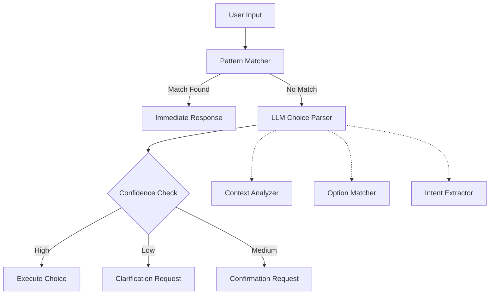

# LLMベース選択処理機能 実装プラン

**バージョン:** 1.0  
**作成日:** 2025年8月17日  
**対象:** ユーザー選択の自然言語理解機能実装  

## 1. 概要

### 1.1. 目的
現在のDuckflowシステムにおいて、ユーザーの選択肢回答を**LLMによる自然言語処理**で理解できるように改善し、より自然で柔軟なユーザー体験を提供する。

### 1.2. 現状の課題分析

#### **現在の選択処理方式**
```python
# 現在: パターンマッチングのみ
class OptionResolver:
    def parse_selection(text: str) -> Optional[int]:
        selection_mapping = {
            "1": 1, "2": 2, "はい": 1, "yes": 1, "実行": 1
        }
        return selection_mapping.get(text.strip().lower())
```

#### **問題となるユーザー入力例**
```
❌ 認識されない自然な回答:
- "その2番目のやつを実行して"
- "いちばん安全なやつで"
- "最初のだけでいいです"
- "全部は無理だから、ファイル作成だけ"
- "バックアップの方がいい"
- "もう少し詳しく教えて"

✅ 現在認識される回答:
- "1", "2", "はい", "実行"
```

### 1.3. 解決方針
既存のパターンマッチングを**安全な基盤**として残し、LLM処理を**拡張層**として追加する。

## 2. 実装アーキテクチャ

### 2.1. 階層的選択処理システム



### 2.2. 核心コンポーネント設計

#### **LLMChoiceParser** (新規実装)
自然言語選択の解析エンジン

```python
@dataclass
class ChoiceContext:
    """選択肢コンテキスト"""
    available_options: List[str]
    option_descriptions: List[str]
    current_plan: Optional[str] = None
    risk_level: str = "medium"
    previous_choices: List[str] = field(default_factory=list)
    conversation_context: str = ""

@dataclass
class ChoiceResult:
    """選択結果"""
    selected_options: List[int]
    confidence: float
    reasoning: str
    modifications: List[str] = field(default_factory=list)
    clarification_needed: bool = False
    extracted_intent: str = ""

class LLMChoiceParser:
    """LLMベース選択解析"""
    
    def __init__(self):
        self.llm_client = llm_manager  # 既存のLLMクライアント活用
        self.confidence_threshold_high = 0.8
        self.confidence_threshold_medium = 0.6
    
    async def parse_user_choice(self, user_input: str, context: ChoiceContext) -> ChoiceResult:
        """自然言語選択の解析"""
        
        # LLMプロンプト構築
        system_prompt = self._build_choice_analysis_prompt(context)
        user_prompt = f"ユーザーの回答: 「{user_input}」"
        
        # LLM解析実行
        analysis = await self._analyze_with_llm(system_prompt, user_prompt)
        
        # 結果パース
        return self._parse_llm_response(analysis, context)
    
    def _build_choice_analysis_prompt(self, context: ChoiceContext) -> str:
        """選択解析用プロンプト構築"""
        return f"""
あなたはユーザーの選択を理解する専門システムです。

## 利用可能な選択肢:
{self._format_options(context.available_options, context.option_descriptions)}

## 現在のコンテキスト:
- プラン: {context.current_plan or "なし"}
- リスクレベル: {context.risk_level}
- 過去の選択: {context.previous_choices}

## タスク:
ユーザーの自然言語回答を分析し、以下のJSON形式で回答してください:

{{
    "selected_options": [1, 2],  // 選択された選択肢番号の配列
    "confidence": 0.85,          // 解釈の確信度 (0.0-1.0)
    "reasoning": "説明",         // 解釈の理由
    "modifications": [],         // 条件付き要求があればリスト
    "clarification_needed": false, // 確認が必要かどうか
    "extracted_intent": "全実行" // 抽出された意図
}}

## 解析ルール:
1. 明確な番号指定は高確信度 (0.9+)
2. 曖昧な表現は中確信度 (0.6-0.8)
3. 理解困難は低確信度 (0.0-0.5)
4. 条件付き承認は modifications に記録
5. 不明な点は clarification_needed = true
"""
```

#### **EnhancedOptionResolver** (既存改修)
```python
class EnhancedOptionResolver:
    """拡張選択解析システム"""
    
    def __init__(self):
        self.pattern_resolver = OptionResolver()  # 既存システム保持
        self.llm_parser = LLMChoiceParser()
        self.choice_history = []
    
    async def parse_selection_enhanced(self, text: str, context: ChoiceContext) -> ChoiceResult:
        """拡張選択解析"""
        
        # Step 1: 既存パターンマッチング (高速・安全)
        pattern_match = self.pattern_resolver.parse_selection(text)
        if pattern_match is not None:
            return ChoiceResult(
                selected_options=[pattern_match],
                confidence=0.95,
                reasoning="パターンマッチング",
                extracted_intent="明確な選択"
            )
        
        # Step 2: LLM解析 (自然言語理解)
        llm_result = await self.llm_parser.parse_user_choice(text, context)
        
        # Step 3: 信頼度に基づく処理
        if llm_result.confidence >= 0.8:
            return llm_result
        elif llm_result.confidence >= 0.6:
            # 中確信度: 確認要求
            llm_result.clarification_needed = True
            return llm_result
        else:
            # 低確信度: 再質問
            return ChoiceResult(
                selected_options=[],
                confidence=0.0,
                reasoning="理解困難",
                clarification_needed=True,
                extracted_intent="不明"
            )
```

### 2.3. コンテキスト別統合ポイント

#### **Plan Approval Integration**
```python
class LLMPlanApprovalHandler:
    """プラン承認のLLM処理"""
    
    async def process_plan_response(self, user_input: str, plan_context: PlanContext) -> ApprovalResult:
        """プラン承認回答の処理"""
        
        choice_context = ChoiceContext(
            available_options=["承認", "却下", "修正要求"],
            option_descriptions=[
                "プランをそのまま実行",
                "プランを実行しない", 
                "プランの一部修正"
            ],
            current_plan=plan_context.plan_content,
            risk_level=plan_context.risk_level
        )
        
        choice_result = await self.enhanced_resolver.parse_selection_enhanced(
            user_input, choice_context
        )
        
        return self._convert_to_approval_result(choice_result, plan_context)
```

#### **Approval System Integration**
```python
class LLMApprovalResponseHandler:
    """承認システムのLLM統合"""
    
    async def interpret_approval_response(self, response: str, operation_info: OperationInfo) -> ApprovalInterpretation:
        """承認回答の解釈"""
        
        # リスクレベルに応じた選択肢構成
        if operation_info.risk_level == RiskLevel.CRITICAL:
            options = ["実行", "却下", "代替案選択", "詳細確認"]
        else:
            options = ["実行", "却下", "代替案選択"]
        
        choice_context = ChoiceContext(
            available_options=options,
            option_descriptions=self._get_option_descriptions(operation_info),
            risk_level=operation_info.risk_level.value,
            conversation_context=operation_info.description
        )
        
        return await self._process_approval_choice(response, choice_context)
```

## 3. 実装ステップ

### 3.1. Phase 1: 基盤実装 (2-3日)

#### **Step 1.1: LLMChoiceParser実装**
- `companion/llm_choice/choice_parser.py` 新規作成
- 基本的なLLM解析機能実装
- JSON解析とエラーハンドリング

#### **Step 1.2: ChoiceContext/ChoiceResult実装**
- `companion/llm_choice/choice_models.py` 新規作成
- データクラス定義
- バリデーション機能

#### **Step 1.3: EnhancedOptionResolver実装**
- `companion/intent_understanding/enhanced_option_resolver.py` 新規作成
- 既存OptionResolverとの統合
- フォールバック機能

### 3.2. Phase 2: プラン承認統合 (2日)

#### **Step 2.1: プラン承認LLM処理**
```python
# companion/plan_tool.py 改修
class PlanTool:
    def __init__(self):
        self.enhanced_resolver = EnhancedOptionResolver()
    
    async def process_user_selection_enhanced(self, user_input: str, plan_id: str) -> SelectionResult:
        """LLM強化選択処理"""
        plan_context = self._get_plan_context(plan_id)
        
        choice_context = ChoiceContext(
            available_options=self._get_available_actions(plan_context),
            current_plan=plan_context.plan_content,
            risk_level=plan_context.risk_level
        )
        
        choice_result = await self.enhanced_resolver.parse_selection_enhanced(
            user_input, choice_context
        )
        
        return self._convert_to_selection_result(choice_result)
```

#### **Step 2.2: Enhanced Dual Loop統合**
```python
# companion/enhanced_dual_loop.py 改修
class EnhancedDualLoopSystem:
    async def _handle_plan_pending_input(self, user_message: str) -> str:
        """プラン保留中の入力処理 (LLM強化版)"""
        
        # 従来のパターンマッチング確認
        if OptionResolver.is_selection_input(user_message):
            return await self._execute_legacy_selection(user_message)
        
        # LLM解析
        plan_context = self._get_current_plan_context()
        choice_result = await self.enhanced_resolver.parse_selection_enhanced(
            user_message, plan_context
        )
        
        if choice_result.confidence >= 0.8:
            return await self._execute_llm_choice(choice_result)
        elif choice_result.clarification_needed:
            return await self._request_choice_clarification(choice_result)
        else:
            # 通常の対話として処理
            return await self._process_normal_conversation(user_message)
```

### 3.3. Phase 3: 承認システム統合 (2日)

#### **Step 3.1: 承認回答のLLM処理**
```python
# companion/approval_response_handler.py 改修
class ApprovalResponseHandler:
    async def _get_user_approval_enhanced(self, operation_info: OperationInfo) -> Tuple[bool, str]:
        """LLM強化承認処理"""
        
        # 従来UI表示
        self._display_operation_details(operation_info)
        user_response = rich_ui.get_user_input("承認しますか？")
        
        # LLM解析
        approval_result = await self.llm_approval_handler.interpret_approval_response(
            user_response, operation_info
        )
        
        if approval_result.clarification_needed:
            # 確認質問
            clarification = await self._get_clarification(approval_result)
            return await self._process_clarified_response(clarification, operation_info)
        
        return approval_result.approved, approval_result.reasoning
```

#### **Step 3.2: 代替案選択のLLM処理**
```python
async def _get_alternative_selection_enhanced(self, alternatives: List[str]) -> Optional[str]:
    """LLM強化代替案選択"""
    
    choice_context = ChoiceContext(
        available_options=alternatives,
        option_descriptions=[f"代替案{i+1}: {alt}" for i, alt in enumerate(alternatives)]
    )
    
    user_input = rich_ui.get_user_input("代替案を選択してください（自然な表現で）")
    
    choice_result = await self.enhanced_resolver.parse_selection_enhanced(
        user_input, choice_context
    )
    
    if choice_result.confidence >= 0.7 and choice_result.selected_options:
        selected_idx = choice_result.selected_options[0] - 1
        return alternatives[selected_idx] if 0 <= selected_idx < len(alternatives) else None
    
    return None
```

### 3.4. Phase 4: 信頼度とフィードバック (1日)

#### **Step 4.1: 確認ダイアログ実装**
```python
class ChoiceConfirmationHandler:
    """選択確認ハンドラー"""
    
    async def confirm_llm_choice(self, choice_result: ChoiceResult, context: ChoiceContext) -> bool:
        """LLM解析結果の確認"""
        
        confirmation_msg = f"""
以下の解釈で正しいですか？

選択: {self._format_selected_options(choice_result.selected_options, context)}
理由: {choice_result.reasoning}
確信度: {choice_result.confidence:.1%}

正しい場合は「はい」、修正が必要な場合は「いいえ」を入力してください。
"""
        
        return rich_ui.get_confirmation(confirmation_msg)
    
    async def request_clarification(self, choice_result: ChoiceResult, context: ChoiceContext) -> str:
        """明確化要求"""
        
        clarification_msg = f"""
申し訳ありませんが、以下の点を明確にしてください：

利用可能な選択肢:
{self._format_options_with_numbers(context.available_options)}

あなたの回答「{choice_result.extracted_intent}」について、
具体的にどの選択肢をお選びでしょうか？
"""
        
        return rich_ui.get_user_input(clarification_msg)
```

## 4. プロンプト設計

### 4.1. 選択解析用システムプロンプト
```yaml
choice_analysis_prompt: |
  あなたは選択解析専門システムです。ユーザーの自然言語回答を分析し、
  適切な選択肢を特定してください。

  ## 解析基準:
  1. 明確な数字指定 → 高確信度 (0.9+)
  2. 説明的指定 ("最初の", "安全な") → 中確信度 (0.6-0.8)  
  3. 曖昧な表現 → 低確信度 (0.0-0.5)
  4. 条件付き回答 → modifications に記録
  5. 質問形式 → clarification_needed = true

  ## 出力形式:
  JSON形式で確信度と理由を必ず含める
```

### 4.2. コンテキスト別プロンプトテンプレート
```python
PROMPT_TEMPLATES = {
    "plan_approval": """
    ## プラン承認解析
    ユーザーはプラン「{plan_summary}」への回答をしています。
    リスクレベル: {risk_level}
    """,
    
    "option_selection": """
    ## 選択肢解析  
    利用可能な選択肢: {options}
    ユーザーは上記から選択を行っています。
    """,
    
    "approval_confirmation": """
    ## 承認確認解析
    操作: {operation_type}
    リスク: {risk_level}
    ユーザーは実行承認について回答しています。
    """
}
```

## 5. テスト戦略

### 5.1. 自然言語選択テストケース
```python
test_cases = [
    # 明確な選択
    ("1番で", [1], 0.95),
    ("2つ目を実行", [2], 0.9),
    
    # 説明的選択
    ("安全なやつで", [1], 0.7),  # 安全な選択肢が1番の場合
    ("ファイル作成だけ", [1], 0.8),
    
    # 複数選択
    ("1と3番", [1, 3], 0.85),
    ("最初の2つ", [1, 2], 0.8),
    
    # 条件付き
    ("1番だけど、バックアップ取って", [1], 0.7),
    
    # 曖昧
    ("いい感じのやつ", [], 0.3),
    ("よくわからない", [], 0.1),
]

async def test_choice_parsing():
    parser = LLMChoiceParser()
    
    for user_input, expected_selections, min_confidence in test_cases:
        context = ChoiceContext(
            available_options=["ファイル作成", "安全モード実行", "完全実行"]
        )
        
        result = await parser.parse_user_choice(user_input, context)
        
        assert result.confidence >= min_confidence
        assert result.selected_options == expected_selections
```

### 5.2. 統合テスト
```python
async def test_plan_approval_integration():
    """プラン承認統合テスト"""
    
    # テスト用プランコンテキスト作成
    plan_context = PlanContext(
        plan_content="ファイルA.pyを作成し、設定ファイルを更新する",
        risk_level="medium"
    )
    
    # 自然言語回答テスト
    test_responses = [
        "ファイル作成だけお願いします",
        "全部実行していいです",
        "ちょっと待って、設定変更は危険じゃない？"
    ]
    
    handler = LLMPlanApprovalHandler()
    
    for response in test_responses:
        result = await handler.process_plan_response(response, plan_context)
        assert result.confidence > 0.0
        assert result.reasoning != ""
```

## 6. パフォーマンスと安全性

### 6.1. パフォーマンス最適化
- **LLM呼び出し最小化**: パターンマッチング優先
- **プロンプト最適化**: 無駄な文脈を削減
- **結果キャッシュ**: 同一入力の結果保存
- **非同期処理**: UIブロックを防止

### 6.2. 安全性保証
- **フォールバック**: LLM失敗時はパターンマッチング
- **確信度閾値**: 低確信度時は人間確認
- **ログ記録**: 解析結果と根拠を保存
- **検証機能**: 重要な選択は再確認

## 7. リリース計画

### 7.1. 段階的ロールアウト
```
Week 1: Phase 1 (基盤実装)
Week 2: Phase 2 (プラン承認統合) + 限定テスト
Week 3: Phase 3 (承認システム統合) + 拡張テスト
Week 4: Phase 4 (確認機能) + 本格運用開始
```

### 7.2. 成功指標
- **自然言語理解率**: 80%以上
- **確信度精度**: 正解率85%以上  
- **レスポンス時間**: 3秒以内
- **ユーザー満足度**: フィードバック収集

## 8. 今後の拡張

### 8.1. 短期拡張 (1ヶ月)
- 多言語対応 (英語)
- 学習機能 (ユーザー固有パターン)
- 音声入力対応

### 8.2. 長期拡張 (3ヶ月)
- 感情分析統合
- コンテキスト記憶
- 予測的提案機能

---

この実装により、ユーザーは「2番目のやつを実行して」「安全な方法で」といった自然な表現で選択できるようになり、より人間らしい対話体験を提供できます。